## Using the Business Application Studio to Create a CAP Application

Now we have our Business APplication Studio installed, configured and ready for use, we should be looking at a screen that looks like this
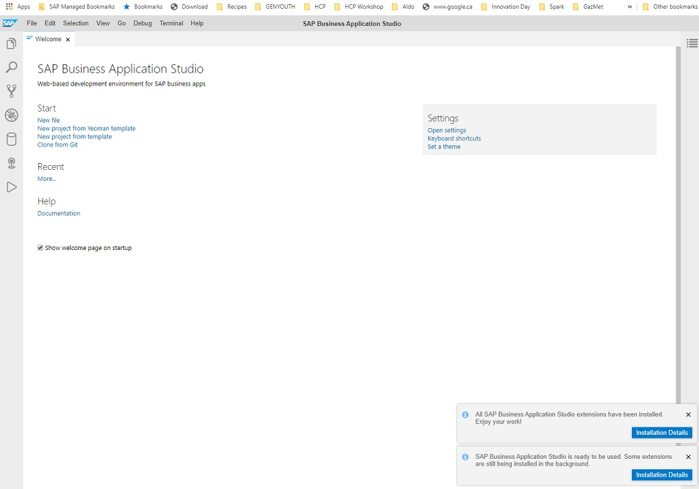

From here, you will select "New Project from Template". 
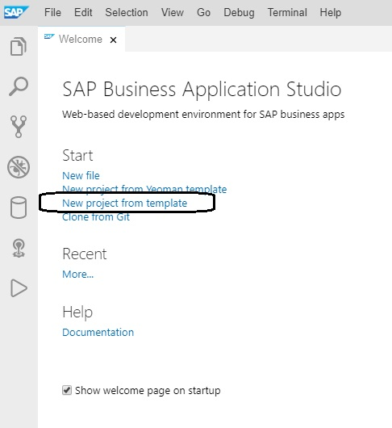

Select the Cloud Platform Business Application Project Generator.
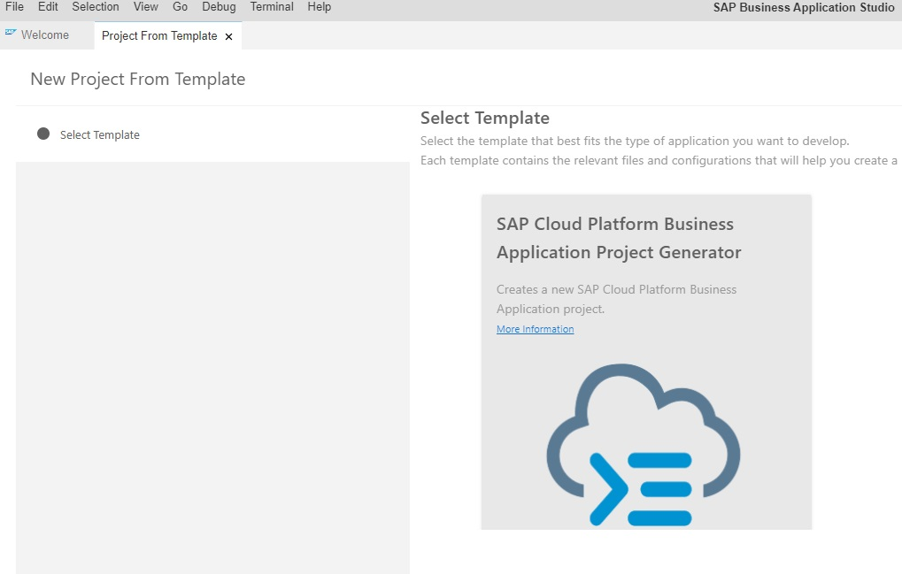

:point_right: You need to provide a name for the project, suggest you use **incidents_p00XXXX**.

**Did you include your username in the name of your project....you should**

After you specifiy a name, Select the check box for "Hana".
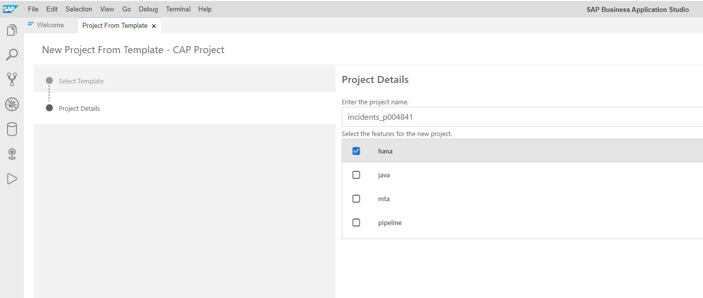

Behind the scenes, your project will be generated. Once complete, the screen will return and you will see a pop-up message box in the bottom right to open a workspace with your project, you need to Open the workspace with this pop-up to start work on your project.

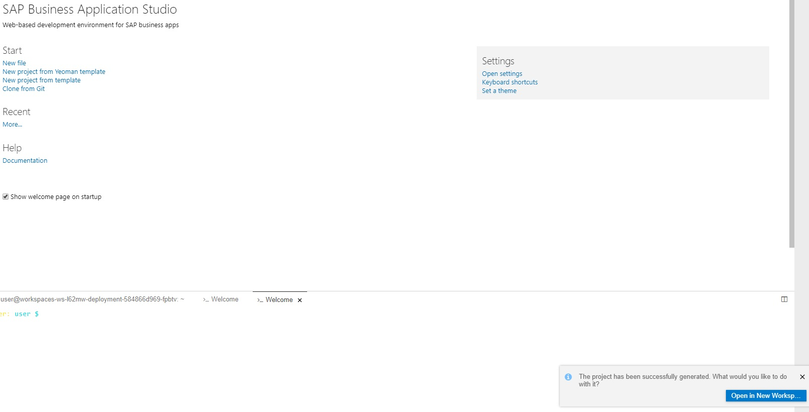

The editor will reopen in the context of a new workspace and now you can begin work on your project. However, you will likely see in the bottom of the screen a message that says that the Space has not been set with Cloud Foundy. 
Why are we seeing this message? It's an information message indicating that currently your BAS installation has no idea how to deploy/connect to Cloud Foundry which is where we eventually want to deploy this application. So, by following through the next few steps we will get you connected to the appropriate Cloud Foundry instance.

You will follow the steps in the following screenshots to connect your app studio to Cloud Foundry. For this connectivity to work, you will be using a different userid...a Platform User ID.
## For these steps use this userid/password but only for these steps user-> xaEA0415 and pwd -> XA4Scott

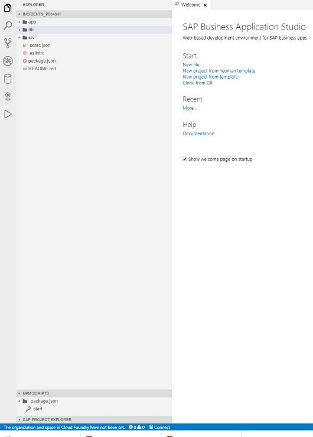

From there, you will use the menu at the top and select View -> Find Command as shown
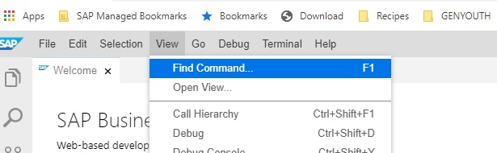

From there, you will look for "CF Log into Cloud Foundry".
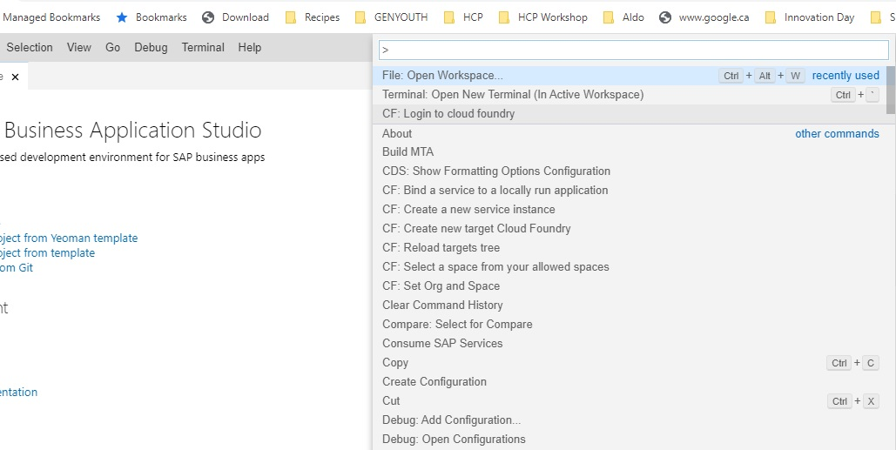

From there, the API endpoint should be automatically inserted into the text box (api.cf.eu10.hand.ondemand.com). 
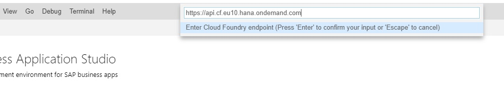

Next, you will be prompted for user credentials...notice you will specify the userid mentioned above...NOT an email address
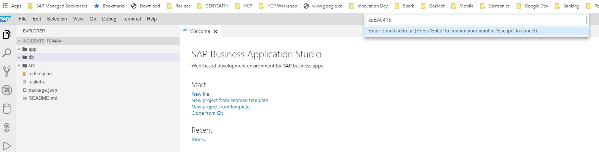

Now, you will enter the password specified above...XA4Scott
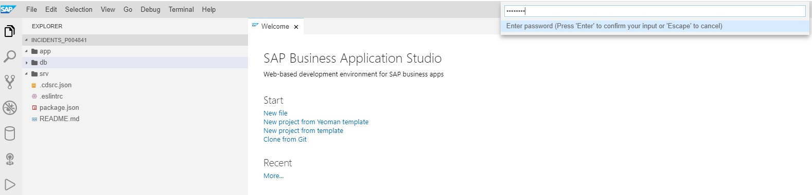

Select the Cloud Foundry Organization that you have been assigned to by your instructor.
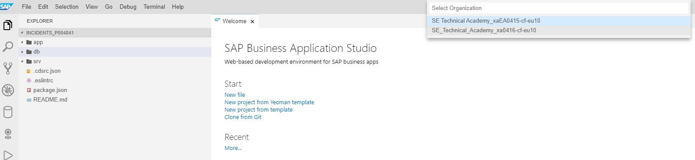

Select the Cloud Foundry Space that is also auto-populated.
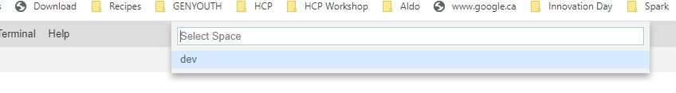

After these set of steps, you should see a connected message at the bottom as seen here:
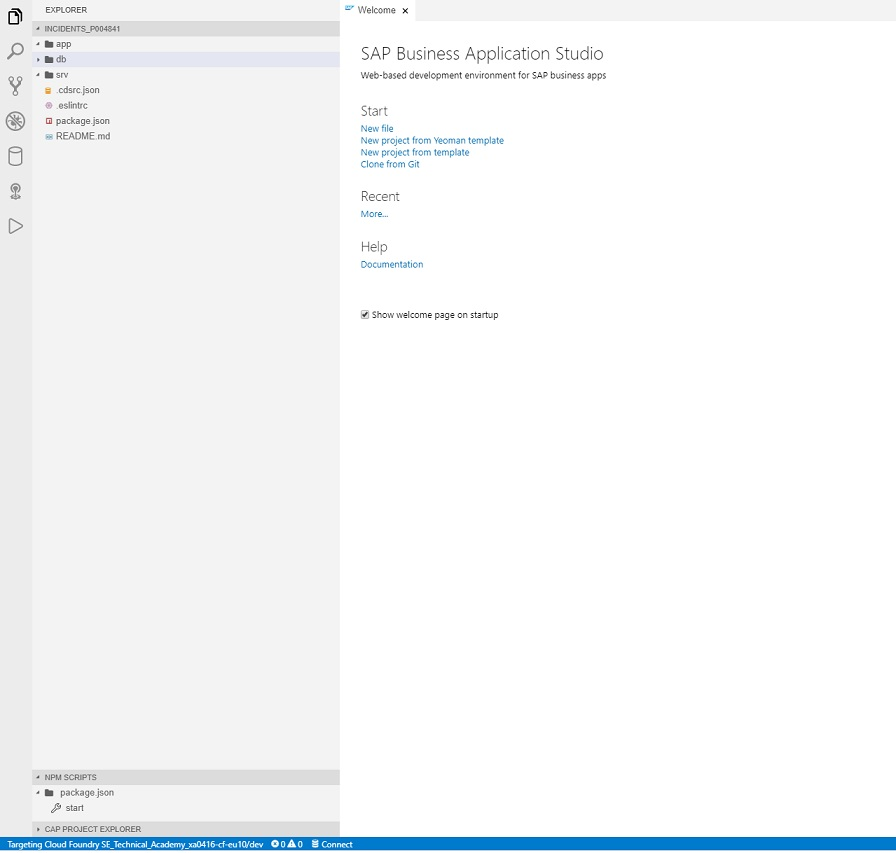

Now we can start to create our first CAP Project.

[Next Exercise](Part2%20-%20Creating%20First%20CAP%20Project.md)

