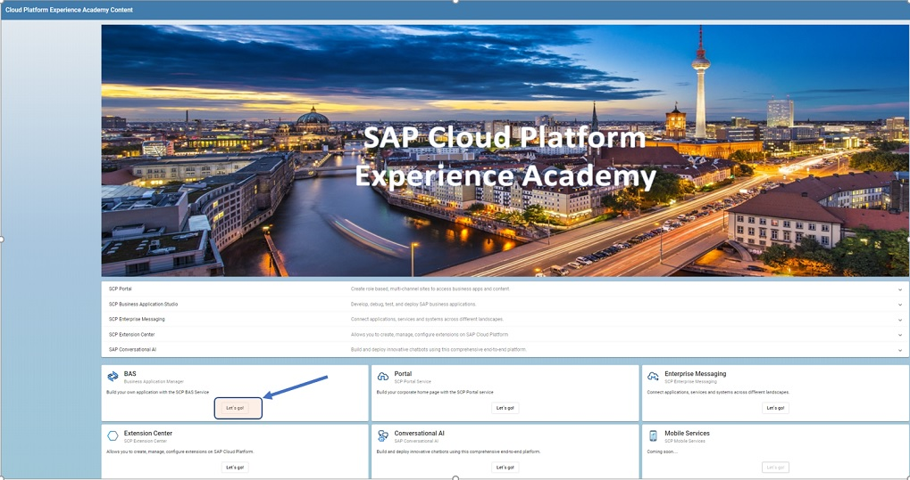
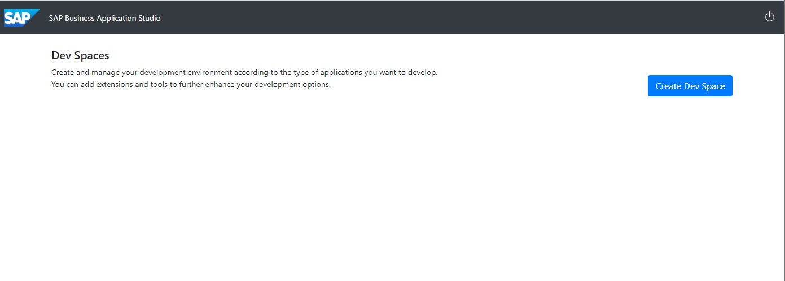
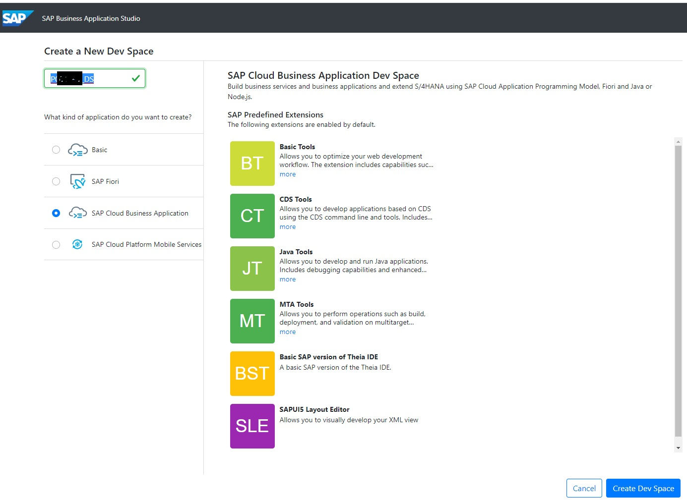
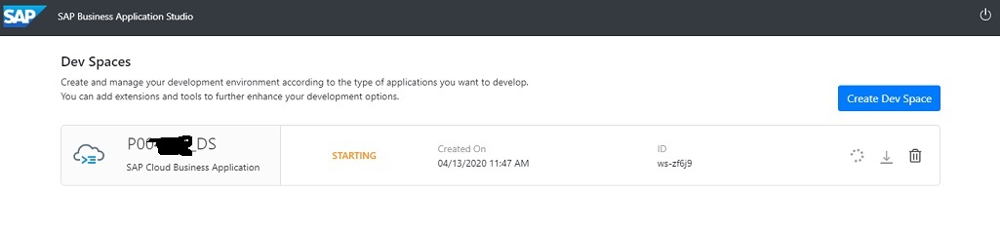
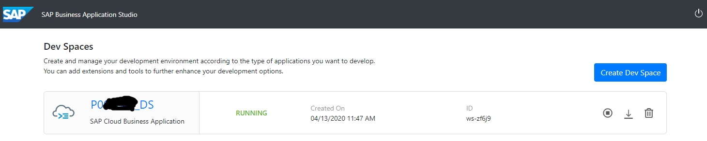

# README
In this section, we will be setting up our backend services required to store the safety incidents. Our goal is to model the backend artifacts that we need and to also publish the services required to expose the backend artifacts as rest and odata.

## Step 1 - Access the TA Landing Page

(*****At this point, you should have a dedicated user for the next 5 weeks****)

**Open a New Browser Window and use one of the following Links**

**VERY IMPORTANT...WHEN ACCESSING THESE LINKS, YOU MUST BE PROMPTED FOR A LOGIN****

We have seen many cases where attendees already have a userid for SCP and you will bypass the logon screen. You might think this is great but it's not :-) You will not get an appropriate setup if you bypass the logon part of the process. So, if you browser defaults to using SSO you will need to take the necessary action to get a logon prompt which could be 1 of several things: Use Firefox..there is a setting in firefox that allows you to setup a prompt for login each time no matter how many certificiates you have installed. However, Firefox does not work for all exercises :-( The best option is to clear your browser of all certificates, clear your cache and then use the links below which should then prompt for a LOGON. Some folks had good success with the installation of the "Brave" browser.

*Canadian Virtual Academy*

https://virtual-scp-roadshow.cfapps.eu10.hana.ondemand.com

*LATAM Virtual Academy*

If Your userid is between P005557 - P005587
https://xa-EA0554.cfapps.eu10.hana.ondemand.com

If your userid is between P005588 - P005618
https://xa-EA0556.cfapps.eu10.hana.ondemand.com

If your userid is between P005650 - P005680
https://xa-EA0558.cfapps.eu10.hana.ondemand.com

For this scenario, we will be using the new Business Application Studio so click on the "Let's Go" within the BAS Tile

You should be prompted with a screen like this one where you will now create a Dev Space by clicking the "Create Dev Space" Button.

From here, you will select the SAP Cloud Business Application Template and provide a name for your Dev Space. We would suggest you make this name unique by including your UserName in the name and append something at the end. 

### Suggest you use P00XXXX_DS for the name. 

After you specify the name and select the "SCP Cloud Business Application template", Click the button "Create Dev Space"

After you hit the "Create Dev Space" button, you should get a screen that looks like this one indicating that your Dev Space is being prepared in the cloud.

After 1-2 minutes, you should see the status of your creation change from started to running which means your Dev Space is now ready. In the background, the Dev Space has been prepared with all of the necessary components that you would otherwise have to install on your laptop. For example, Node JS, CDS, etc...

Once the Dev Space, says created, you will see that the Dev Space Name becomes clickable (far left of screen next to the cloud symbol). Click on the name to open it and proceed to use Business Application Studio. If you are ready to continue, click here to jump to the next exercise:

[Next Exercise](Part%201%20-%20Setting%20up%20BAS.md)
