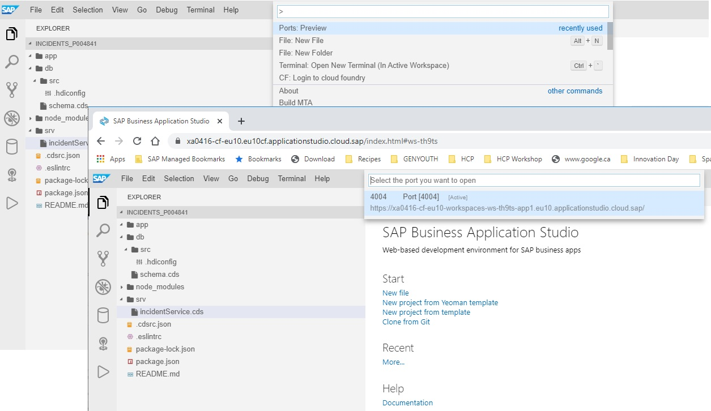

## Viewing ports and running Services

As you make your way through the exercises, you might find that we ask you to view the running service by opening a window/clicking on a popup, etc... Sometimes the link will disappear if it's been on the screen for a long time. In these cases, you can follow the instructions below to find the currently running services

From the BAS Menu, you will follow View -> Find Command -> Ports for a list of applications running on ports. At this point, you should only see one but if you have opened several terminals, there is a chance you you might see several. Just click on the link to reopen the window with the running application as shown below in the screenshot.

