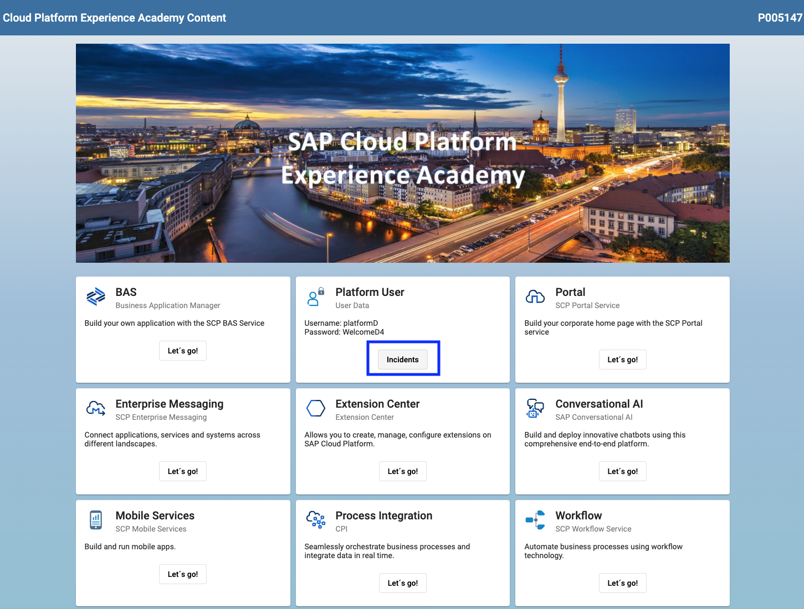
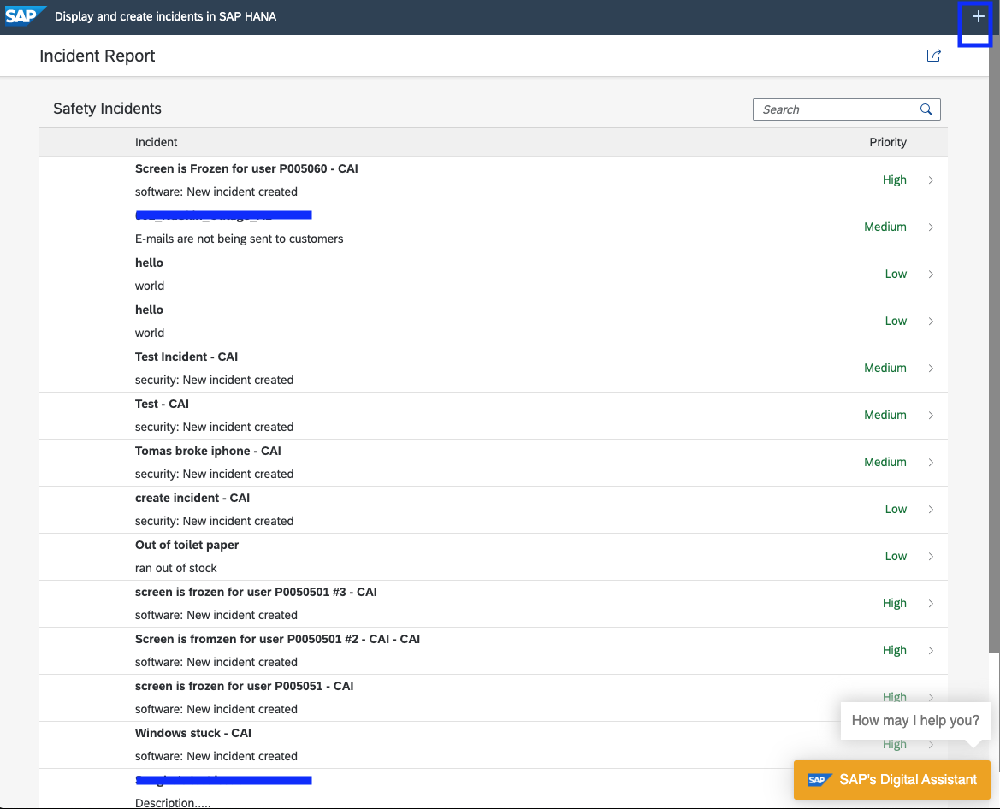
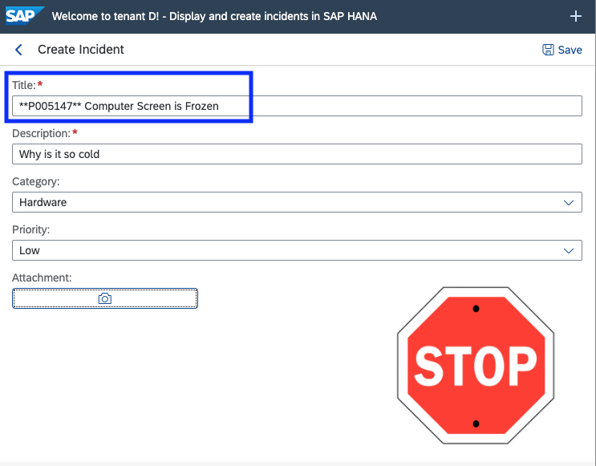
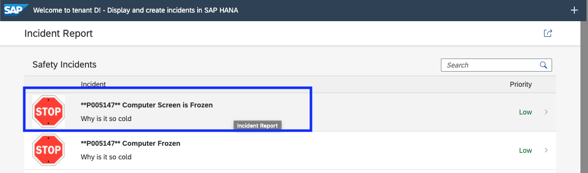
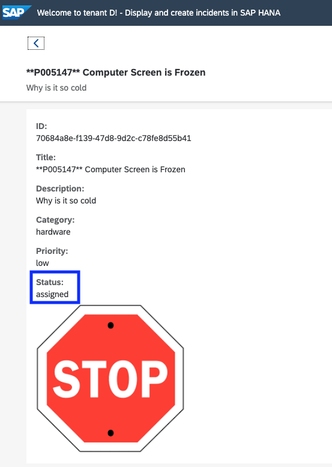
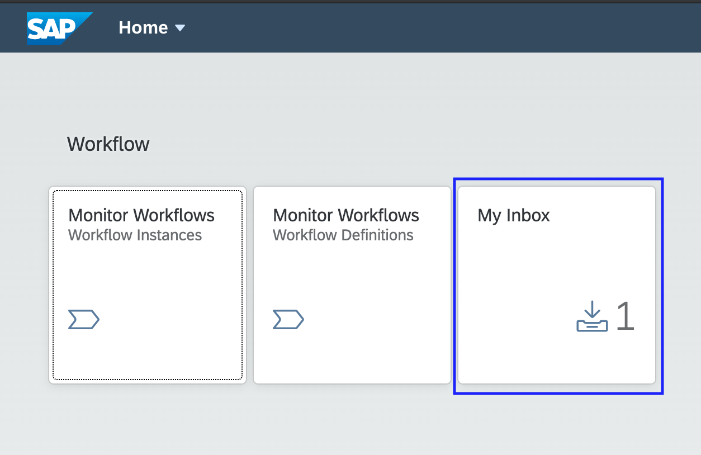
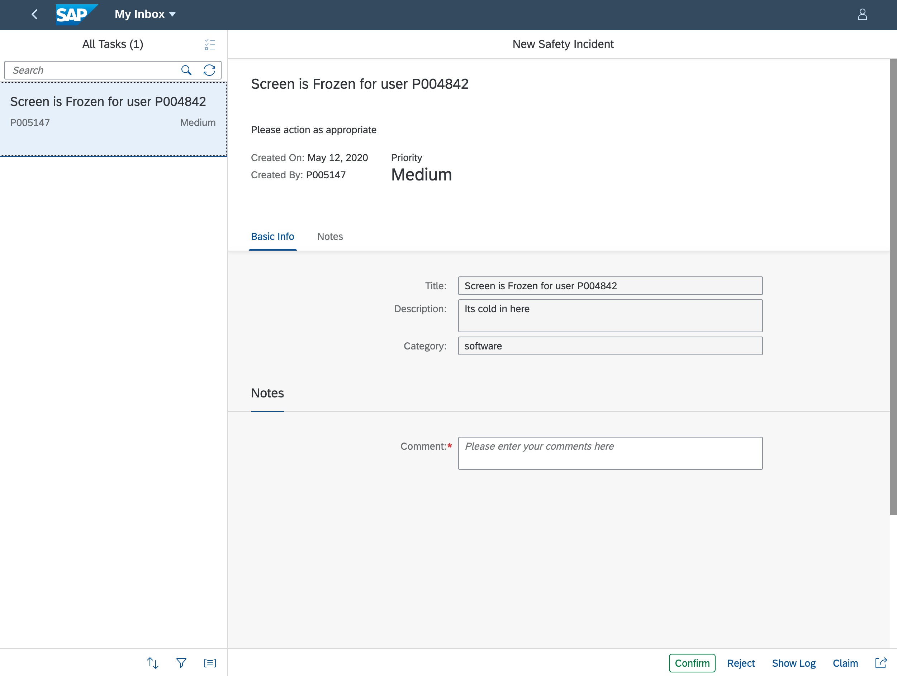

# Testing the Safety Incident Integration

In this section, you will learn how to the test Safety Incident Integration.
* By creating an incident in the test application provided by SAP
  * Once the Incident is saved, you will see the workflow in the Fiori Launchpad Inbox
  * You will also see the Incident saved on the FTP folder 

## Let's test.. 

We have created an application to help test your workflow. 

Access the following link on your phone, IPad or laptop
* Right click the link and "Open Link in New Tab"  https://virtual-scp-roadshow.cfapps.eu10.hana.ondemand.com

Click on the "Incidents" button in the Platform User tile.



Once you have the test application open - keep it open, you may want to use it to create multiple incidents.

You should see the following application (Note: it might look different depending on the device). This is a preview of what you will be building in a few weeks.



### Create an Incident with the application  

You can create a new Safety Incident by pressing the + sign in the upper right hand corner of the screen. 

When you click the '+' icon, the following screen will be shown. 



Fill in the details - Pay special attention to the title. 

* Note: 
  * You **must** prefix the **Title** with "\*\*P00XXXX\*\*" as indicated in the image. Where P00XXXX is your user ID. 
  * This is important since this will be used by the serverless function to create **your** workflow. 
  * **If you do not use your User ID as indicated above - You will not see the workflow in your inbox**

Press the save icon.

You should now see your Safety Incident in the search results 



Click on the incident to verify the status of the incident. It should be "Assigned".

```
When the incident is created - the status is "New", but 
The incident has already been published and the workflow has been triggered

The workflow has already changed the status to "Assigned"

If your sttaus is "New", then there is a problem
```



As soon as the Incident was created, a message was published to your topic

```
We will show you how to publish to the Enterprise Message Service 
When you develop the SAP UI5 Safety Incident UI.

If there is an error, go the section below on checking the Serverless Function Logs
```

### Check the Fiori Inbox - Did the workflow get triggered?

Open your Inbox from the workflow session.
**Add Information on how to access flp**

You should now see your Workflow in the inbox.



* If you forgot the URL of your Fiori Launchpad, speak with one of your instructors 

Leave the inbox open. Go back to the test application and create multiple Safety Incidents. 
Refresh the inbox - You should see the number on the Inbox tile increase. 

Click on the Inbox tile to see the workflow items that you just created. 



## Let's now check the Serverless Function Logs.

Go back to the following link https://virtual-scp-roadshow.cfapps.eu10.hana.ondemand.com
Click on the "Let's Go" in the Extension Center tile.


Now you will see the Extension Center User Interface.

Click on the tile for the function "initiateworkflow".


You will now see the function 


You can use the function logs to see if your safety incident was processed by the function or if there was a problem 

Click on the "Logs" tab.


You will now see the logs for the function. As the function is triggered, it will write to the logs. 


In the image above, you can search for your user ID to see your logs. Find the Safety Incident by payload or by time. You can see the payloads and even the request to trigger the workflow. Check if you have a success message (i.e. http code 201). 

You have now tested the workflow, lets test the IFlow that you have created.

### Check if the Integration Flow was triggered

To check if the iFlow was properly triggered, you need to check if a
file was actually created in the SFTP server. To do this, you need to
install an SFTP client on your machine such as
-   FileZilla
    ([https://filezilla-project.org](https://filezilla-project.org))
-   WinSCP ([https://winscp.net](https://winscp.net))
or similar.

**Notes:**
-   If you don't want to do this, you can ask your instructors to check
    for you.
-   For this documentation, WinSCP was used, but steps for FileZilla are
    similar.

Start the program WinSCP. Enter the following information and press
Login button.

Host name: **cpta.sftp.solex.voracloud.sapcloud.io**

User name: **cptafiles**

Password: **Welcome1**


Once connected, open folder GTM.


If your iFlow has been properly triggered, you should find a folder
named PXXXXXX.


And, inside of this folder, you should have (at least) one file named
with the ID of the incident(s) that you have just created. And if you
open one of these files, you will find all the information about your
incident.


Congratulations, you have automated the creation of workflows and Integration flows using Enterprise Messaging and the Safety Incident Application. All of this was done leveraging a publish, subscribe integration based architecture with very little coding and configuration.
