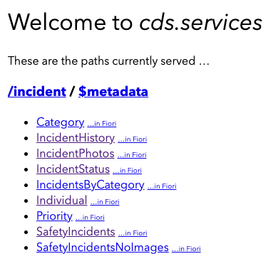
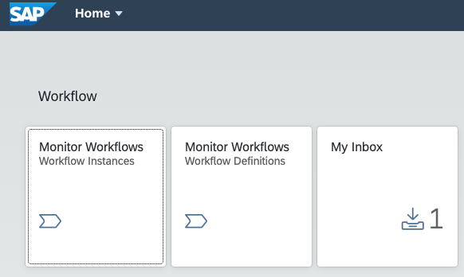
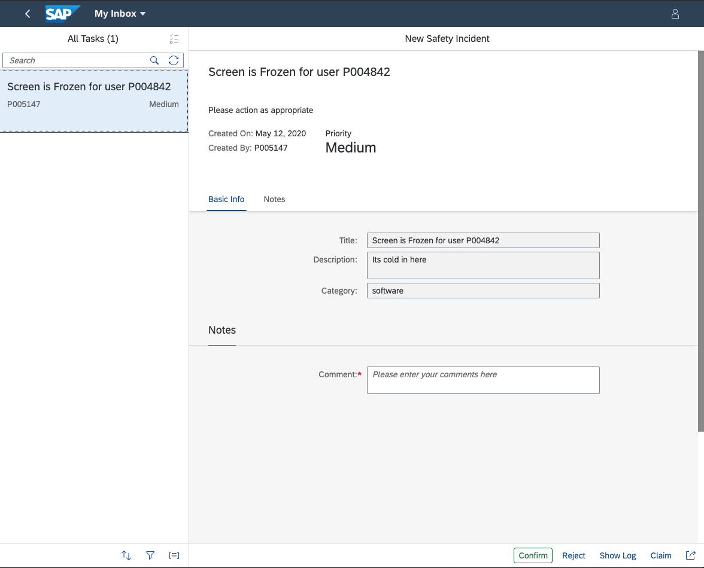
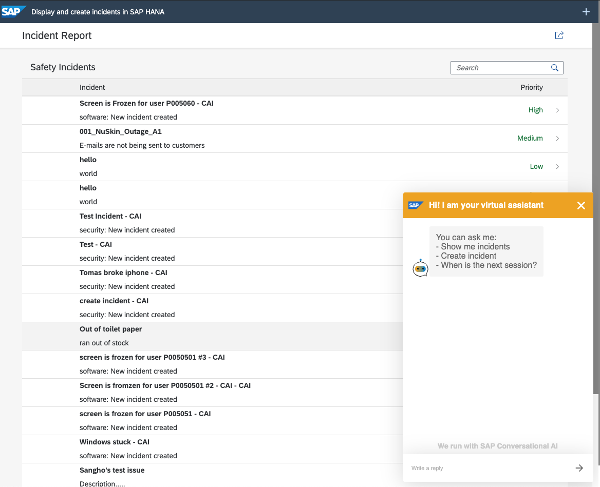

# The Safety Incident Application so far...

We are in the process of developing a Safety Incident Management application. Let's see what we have accomplished so far.

We used the Cloud Application Programming Model(CAP) to easily build the foundation for our Safety Incident Management application. At the end of of the first exercise, we deployed a series of fully functioning Safety Incident services. This is the foundation of the Safety Incident application.

We then developed a Safety Incident Workflow and deployed it to our own Fiori Launchpad. 

We saw how easy it is to test. We only have to set the Incident ID. 

We also had a preview of the SAP UI5 application and Chatbot which you will create in a future session. 

# What will you see in this session

The objective of this session is to integrate the CAP services with the workflow service. We will introduce the following SAP Cloud Platform Services:

* [Enterprise Messaging](https://www.sap.com/products/cloud-platform/capabilities/integration.services.html#enterprise-messaging) 
  * As a Safety Incident is created, it will be published to the Enterprise Message Service. Consuming applications or services can then take the Safety Incident and action it (i.e. create a Safety Incident workflow or Save the incident as a file).
  
* [Extension Factory, Serverless Runtime](https://www.sap.com/products/cloud-platform/capabilities/enterprise-extensions.serverless-runtime.html)
  * As you publish incidents, consumers will be listening. 
  * The first consumer is an SCP serverless function. This function will take your message, parse it and then create a new workflow. When the workflow is created, you will see it in your inbox like you did in the workflow exercise.
  * SAP has preconfigured this scenario. You will not be configuring this scenario as part of this exercise.
  
* [SAP Cloud Platform Integration](https://www.sap.com/products/cloud-platform/capabilities/integration.cloud-integration.html) 
  * The second consumer is an SCP Integration Flow, which is listening on the queue. When a message is published, the Integration flow will automatically trigger, transform the payload and store the safety incident as a file on the SFTP server.
  * You will be creating the Integration Flow as part of this exercise.
  

## What is the Motivation to use the Enterprise Messaging service

You will see that SCP Enterprise Messaging opens up opportunities and potential for innovation. 

In the exercise today, we will show two consumers (An Integration Flow and a Workflow Service). 

In the future if you have a new scenario, just register the consumer (like you will do for the Integration Flow) on the service and 'Voila', they now have access to the data.

### Motivation

The true benefit of this architecure is that the Safety Intelligence application does not have to know which applications or services need Safety Incidents, the application just has to publsih an event "Incident Created". It is up to the consumers to register for the event. This is a loosely coupled integration architecture.

* Instead of sending messages directly to receivers they will be sent to a messaging broker, who then forwards the message.
* Applications or services on different platforms can exchage data easily 
* Dependencies on specific protocols or libraries are drastically reduced. We all agree on a simplified set of protocols and API's

# At the end of this session 

At the end of this session you will be able to create a Safety Incident and automatically trigger a workflow and save the Incident to a file.

**Note: We will still be using the test application provided by SAP to create Safety Incidents. Please use the test service that is indicated in this document since it may be different than the one used in the previous exercise**

Let's start by understanding the SAP Cloud Platform Set-Up

[Next](Part%201%20-%20SCP%20Setup%20for%20Enterprise%20Messaging.md)

