# Building a mobile application with MDK

Okay, so now that you have configured the application within mobile services, we are going to start building the mobile application. From the landing page, start the WEB IDE, the same tool you used to create the workflow.

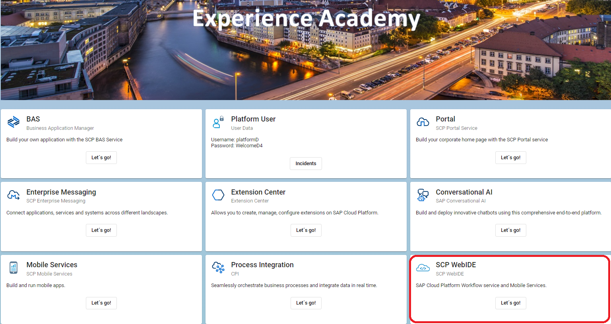

Once the Web IDE is started, you need to ensure 2 things:
- The cloud foundry connection is still active
- The extension for mobile development is installed

As in the following screenshot, select the configuration icon on the left, its the last one on the list and shaped like a cog. Validate as per the screenshot that you still see your Cloud Foundry environment connected. If not, you will select it from the list using the correct environment that matches your platform user.
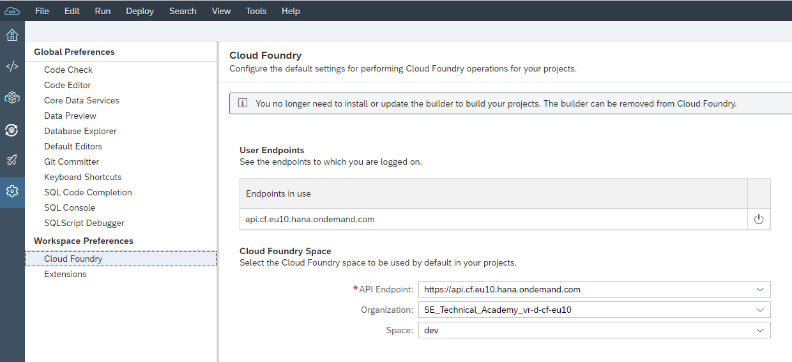

After you validate your CF environment, now we will activate your mobile extension. From the same configuration area, select extensions and then scroll down or search for "Mobile". Once you find it, if it's not activated, you will simply slide the button to activate it. At this point, you will be prompted to refresh your Web IDE in order for the extension to be installed. Once it restarts, we are ready to build.

Within the WebIDE, there are several different perspectives and you choose the one depending on the type of development you would like to do. In our case, we will select the MDK perspective as shown in the screenshot, it's the one that looks like a cube wrapped in 2 arrows.

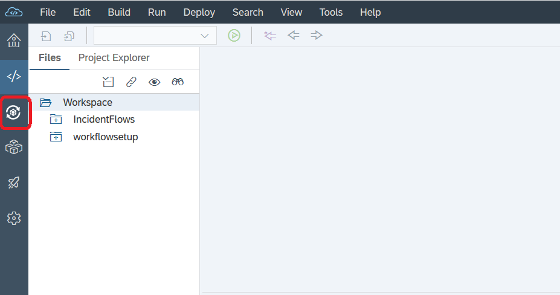

From within the MDK perspective, we will now use an MDK template to create our project. Right click on the workspace and select "New" and "MDK CRUD Project".
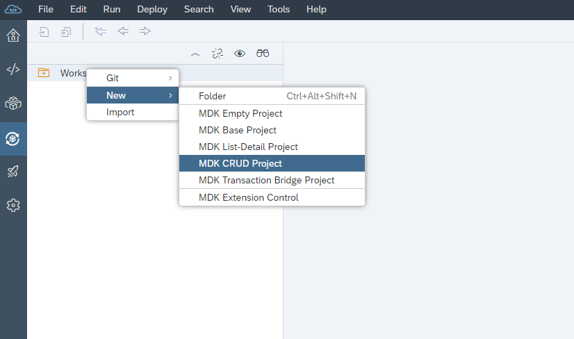

Specify a project name, I used "VirtualAcademyP00XXXX"
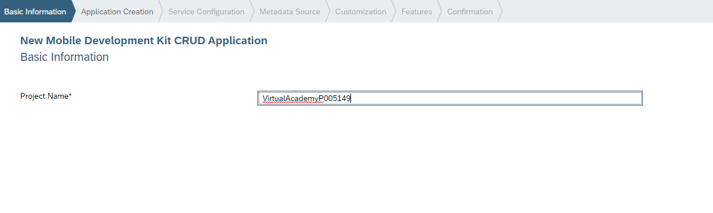

Specify the application name, "IncidentReporting"
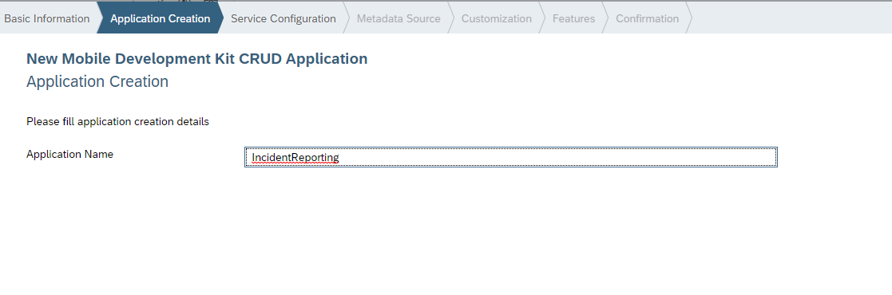

Now we will use the configuration that we did in the mobile services cockpit.

**Important**

Be sure to select the right entry from the Service URL Dropdown, select the entry that corresponds to your platform user. For example, I am allocated to platform D, so I have selected the mobileservices_cf_d. Once you make this selection, the Web IDE will connect to the Mobile Services cockpit and populate some of the fields. For the Application ID, you should find an application ID in there that matches your userid. Once you select the application ID, the destination name should be populated if you properly configured the mobile services cockpit. 
**BE SURE TO DESELECT 'ENABLE OFFLINE STORE'**
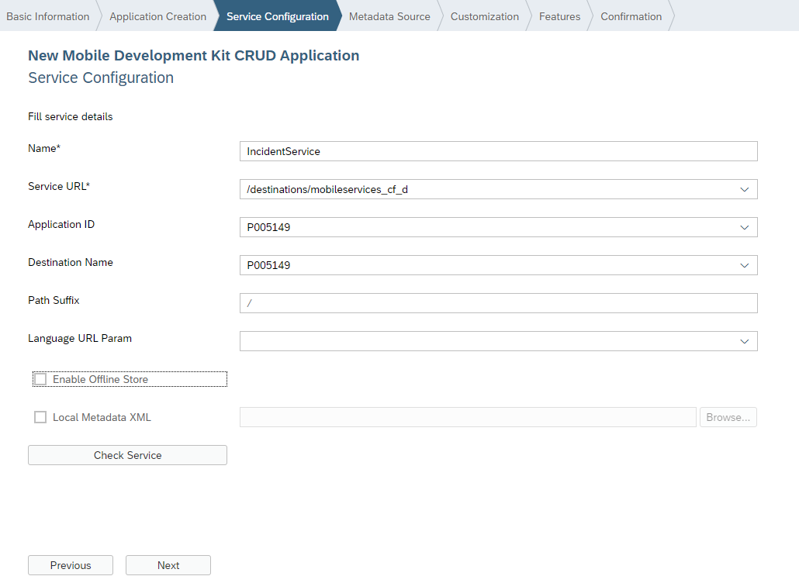

Once you have filled out the necessary fields as per the above screenshot, you need to validate the service by clicking the "Check Service" button. If you have done everything correctly, you should see the following Blue Message Appear towards the top of the screen.

** Just a reminder, did you DESELECT 'ENABLE OFFLINE STORE' **

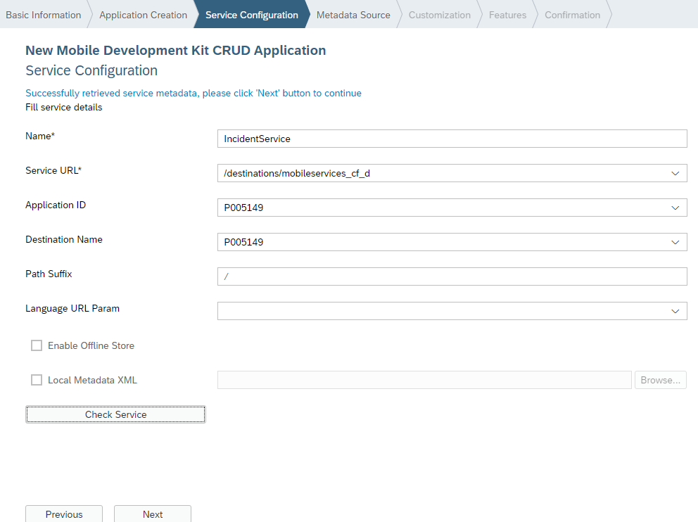

Once you have the blue message, we can click next to bind our data to the various screens.For the datasets, we will only select **SafetyIncidents**.
We will then bind the individual elements to the fields generated by the template for the list. Ensure that your binding matches the screenshot below:
*Note: You can see in the images which fields appear where*

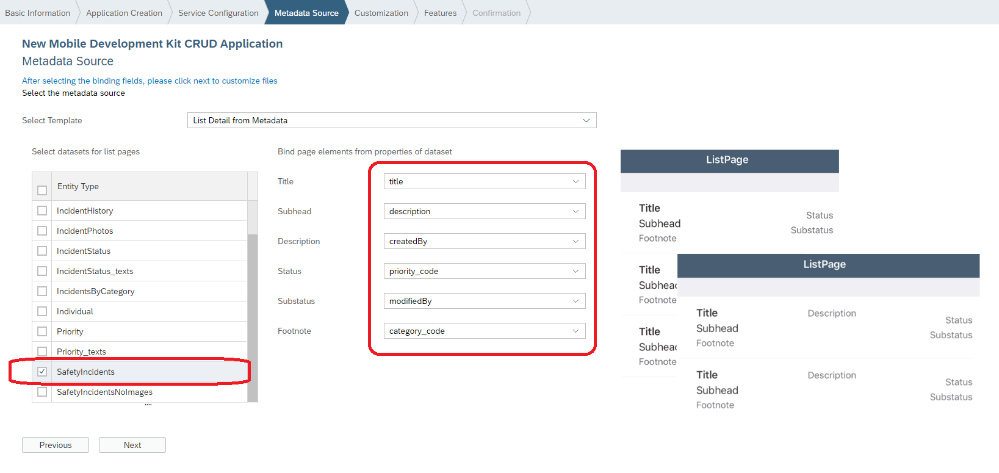

Continue to the next page. We will now assign the properties for the add and edit pages. The easiest thing to do here is to deselect all of the properties and then select the ones we would like to have appear:
- title
- description
- category_code
- priority_code
**Repeat the same process for both the add and edit page**
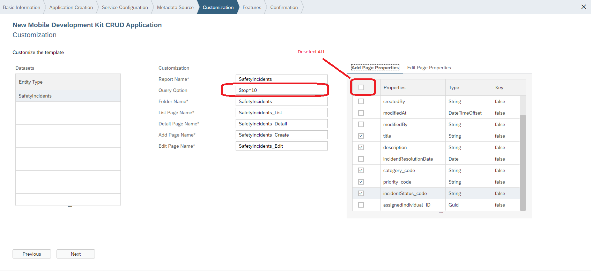

Once you have specified the fields, you can click next and then finish.
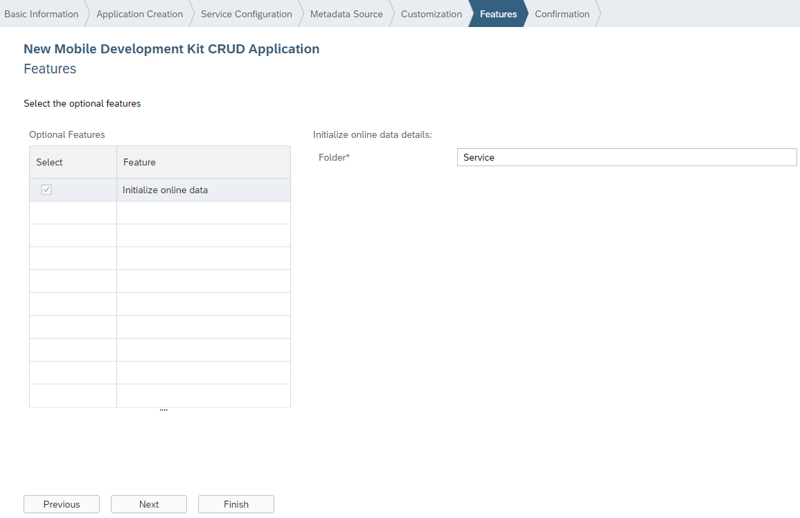

Now, within the Web IDE, you should see a series of folders that have been generated by the template. 
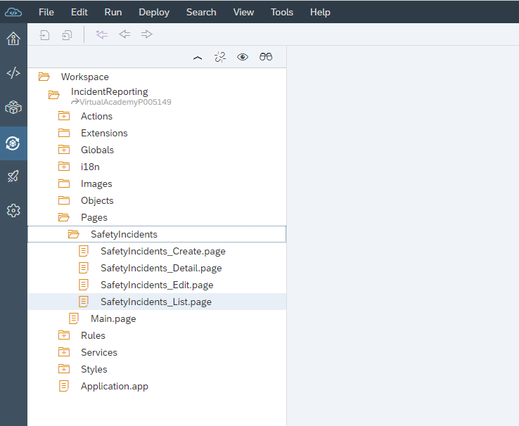

The last thing to do is modify one of the service options to account for a small issue in the oData service. From the folder structure, expand the Services folder and double click the "IncidentService.service" file. It will open the service editor. Towards the bottom, you will see the "Service Options" highlighted in the screenshot, click it to expand and see the property we want you to modify.
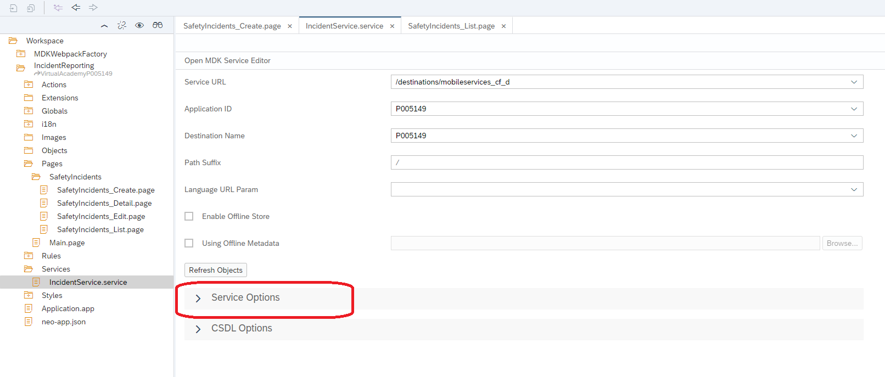

Find the **requiresType** propery, select it and set it to *False*.
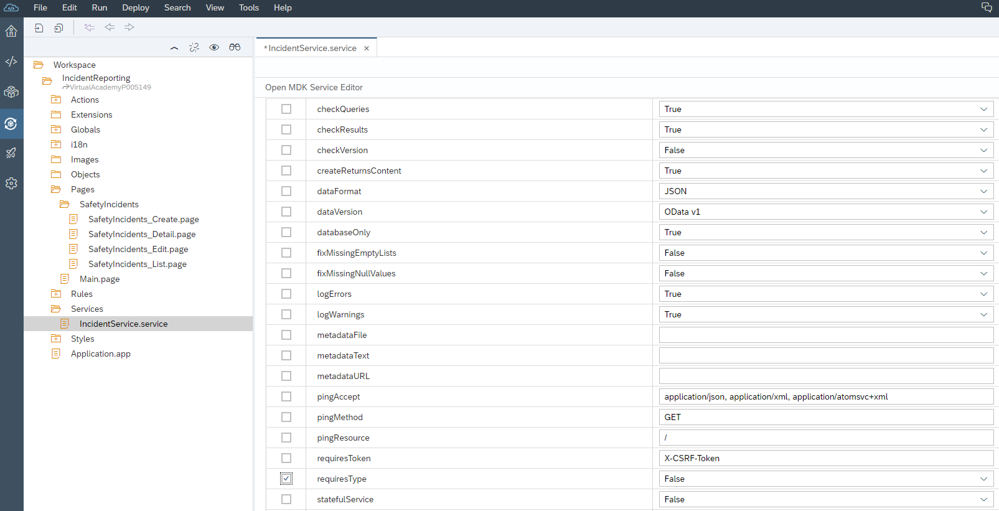

Congratulations, you have finished configuring the template and at this point you should have the ability to deploy and see your safety incidents on the mobile device.

[Next Exercise](Part3.md)

