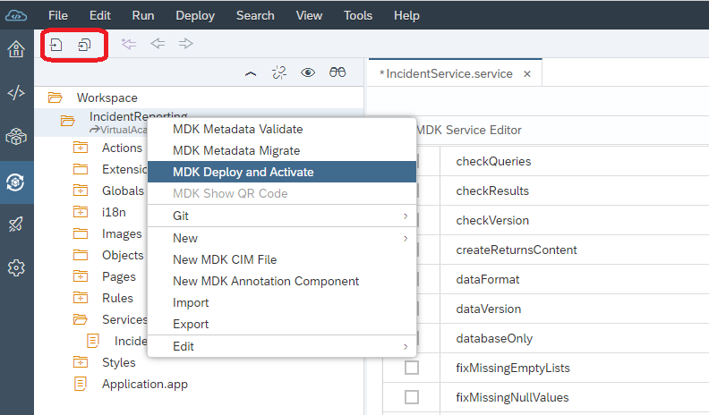
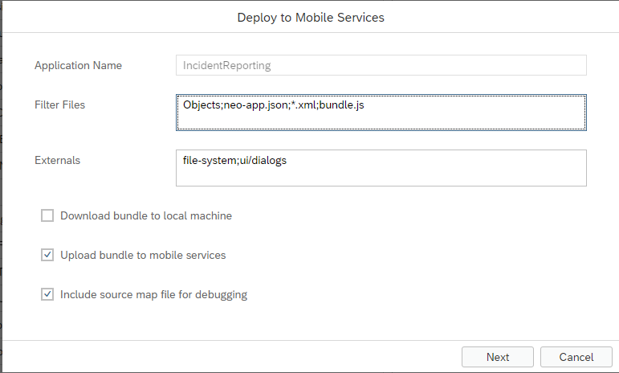
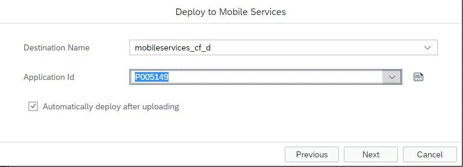

# Deploying a Mobile Development Kit Application

If you have completed Part 2 Successfully, you are now ready to deploy and try viewing and creating safety incidents on your phone. 

From the workspace, the first thing you should validate is that you don't have any unsaved changes. You can use the menu and do a File -> SaveAll or you can use the Icon for save/save all just above the workspace.
Once you have saved all your work, you can right click on the project name...IncidentReporting...and select MDK Deploy and Activate

You will then be prompted with the following screen, you can push Next.

On this next screen, please ensure that your destination name and application id have been selected in the dropdowns. when you click *Next* on this screen, the application will start to deploy

.

As the project starts to deploy, you will see infomrational messages start to display in the console.
If all goes goes, you should see something similar to the following;

.

If you see a message that the application has been deployed successfully, continue to the next exercise.

[Next Exercise](Part4.md)

