# Connecting the Mobile Client to SCP Mobile Services

If your application deployed successfully in the last exercise, we can now install and deploy your application. In order to do so, we will be installing the **SAP Mobile Services Client** on your device.

For iOS devices, you can find it here:

https://apps.apple.com/us/app/sap-mobile-services-client/id1413653544

or just scan this QR code with your mobile device:

For Android, you can find it here:

https://play.google.com/store/apps/details?id=com.sap.mobileservices.client&hl=en

or just scan this QR code with your mobile device.

# iPhone Installation Procedure (See below for Android)
As you can see in the first image, I have found the application and then in the second screenshot, I have it installed. This next step is VERY important.
** DO NOT OPEN THE MOBILE CLIENT ** You will be tempted,but don't do it. You will see why shortly.

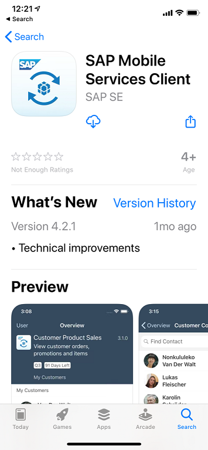

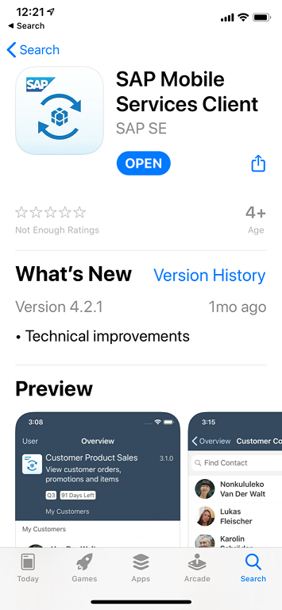

Now we will go back to the Web IDE because we somehow need to connect the mobile client to your mobile services account and we will do this via a generated QR Code that you will scan 

**WHILE THE MOBILE CLIENT IS STOPPED, NOT RUNNING, NOT OPEN **

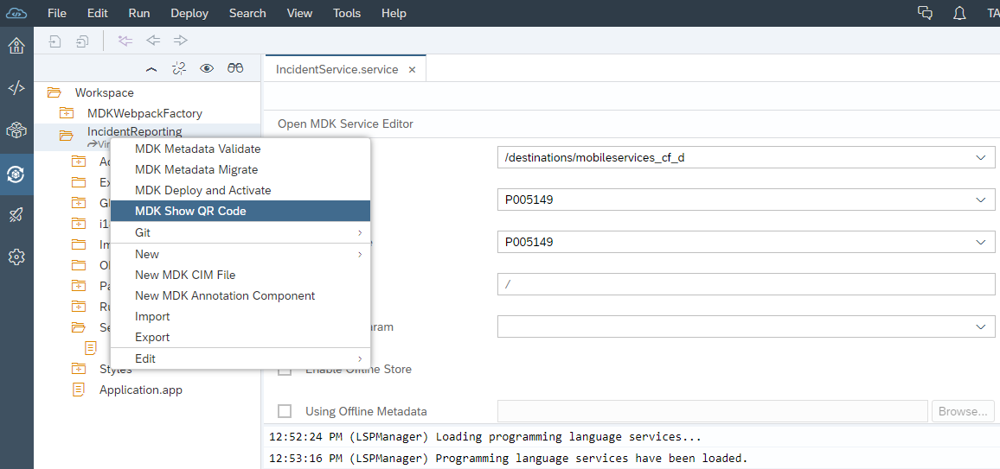

Now you will see a QR code that looks like this:

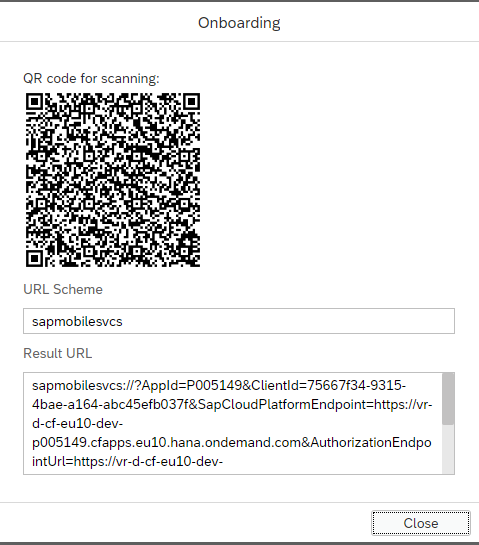

**Please ensure mobile client is stopped**

**THE QR CODE ABOVE IS FOR MY ACCOUNT....DO NOT SCAN THIS ONE **

Once you stop the mobile client (perhaps I have said this enough :-), you will then scan the QR code. On an apple device, you just scan it as the screenshot shows below. This is me, scanning my code with my iPhone Camera. Once you scan the QR code, it will prompt you with a link at the top of the screen to open the application. On Android devices, you will need to install a QR Code reader.

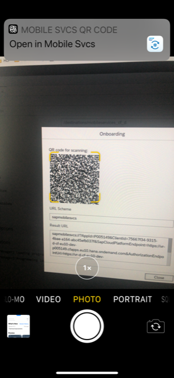

You should now be prompted with a startup screen from the SAP Mobile Client, click the "Start" button:
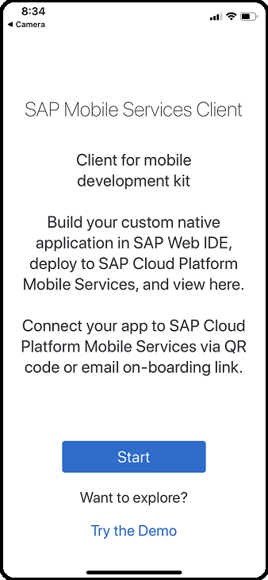

You will then need to authenticate to use the application, you will use your P00XXXXX user.
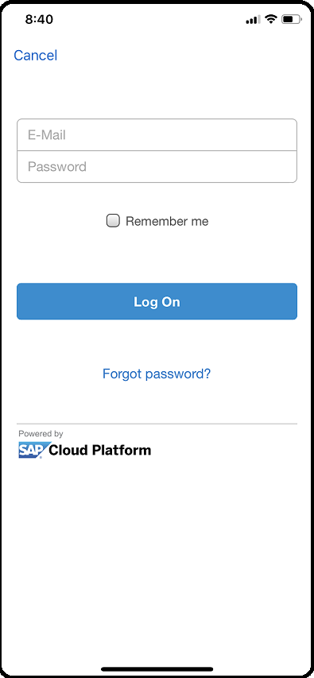

You will then need to accept the license agreement in order to continue onboarding the application.

Next, you will need to specify an 8 digit passcode and you will have to confirm it after initial entry:
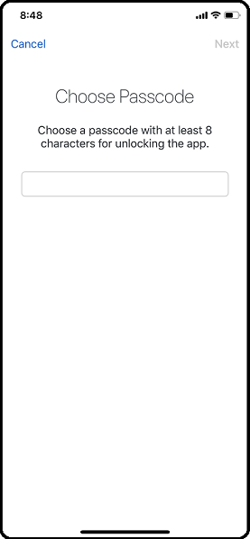

Now you have the option to enable Face ID, be default it is Enabled but you can choose "Not Now" if you prefer. At this point, the Mobile client will connect to SAP Mobile Services in order to download the application that you have created. You should see the following prompt for an update. Press "OK".

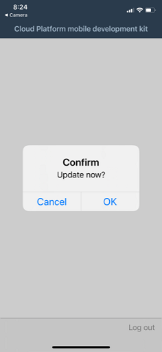

If you see the following screenshot, you have successfully built and deployed a native application to your phone without writing a single line of native code for that device. At this point, you should be able to click the SafetyIncidents Button and see a list of the Safety Incidents. In fact, you should be able to view, create, update and delete safety incidents.
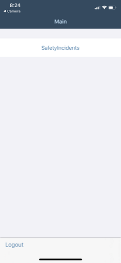

## Android Installation Procedure

The first thing you will need to do is install a QR Code reader. Scanning with your camera on an Android device, typically does not work to activate the mobile client. Not all QR Code readers will work on the various Android devices but this is one that I have had good success with just in case you wish to try with Android.

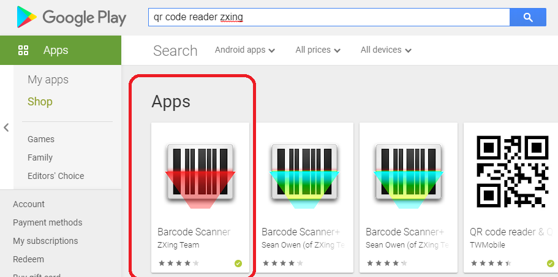

Now that the QR Code Reader is installed, lets find and install the Mobile Services Client on the play store.

Once the Google Play Store is open, do a search for "SAP Mobile Services Client" 

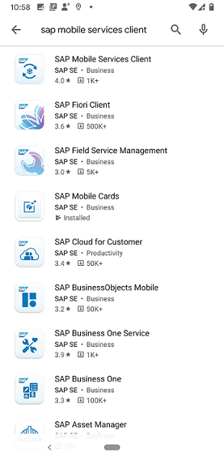

Select the Mobile Services Client and then hit the Green Install button

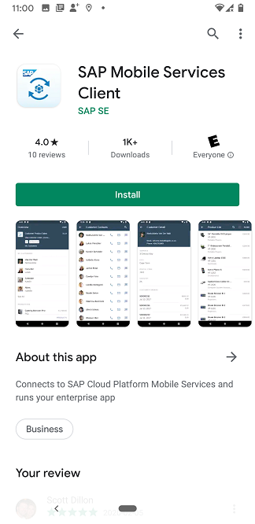

Once the mobile client is installed as below, do **NOT** open it. Just close it down.

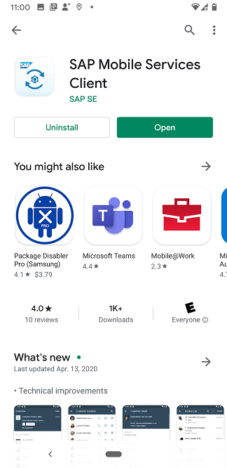

Now we will go back to the Web IDE because we somehow need to connect the mobile client to your mobile services account and we will do this via a generated QR Code that you will scan 

**WHILE THE MOBILE CLIENT IS STOPPED, NOT RUNNING, NOT OPEN **

Now you will see a QR code that looks like this:

**Please ensure mobile client is stopped**

Now we will scan the QR Code with the QR Code Reader Application.

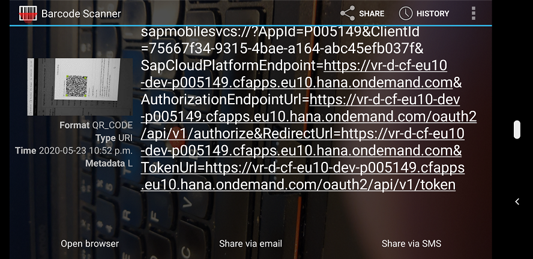

As per the screenshot, you will now select "Open Browser" which in fact starts the Mobile Client.

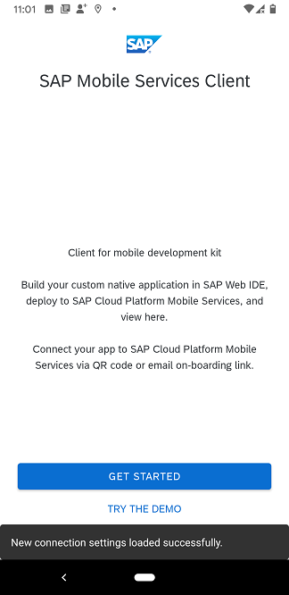

At this point, you will be prompted for username/password but on my Android device it will not permit me to take a screenshot.

Next, you will be prompted to accept the License Agreement.

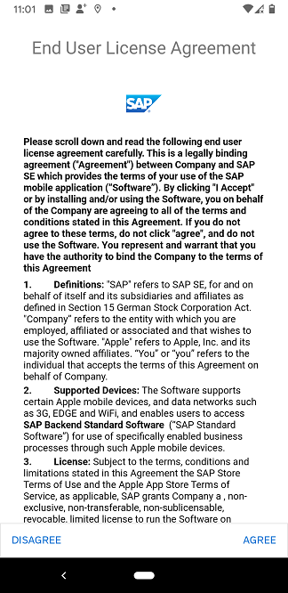

Now you will be prompted to enable a passcode or if you phone has it, enable the fingerprint reader. In my case, I enabled the passcode.

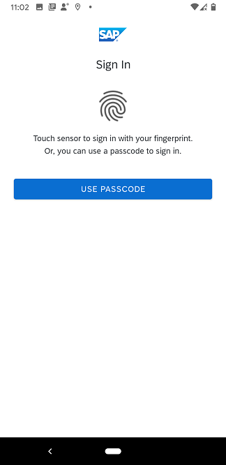

You will be prompted for passcode:

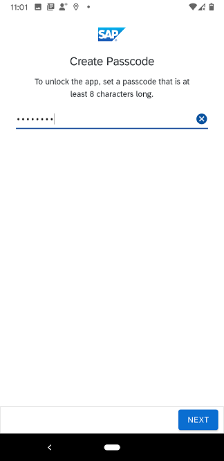

After the passcode is enabled, the mobile client will contact mobile services to download the application and you will be prompted to confirm the update of the application....click "OK"

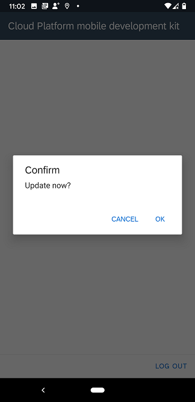

If all the configuration has been done properly, the application should now appear on your Android device.

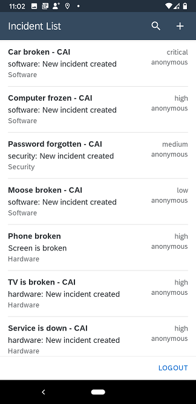

[Next Exercise](Part5.md)

