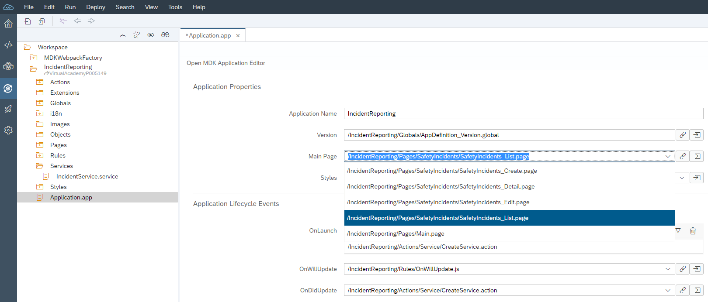
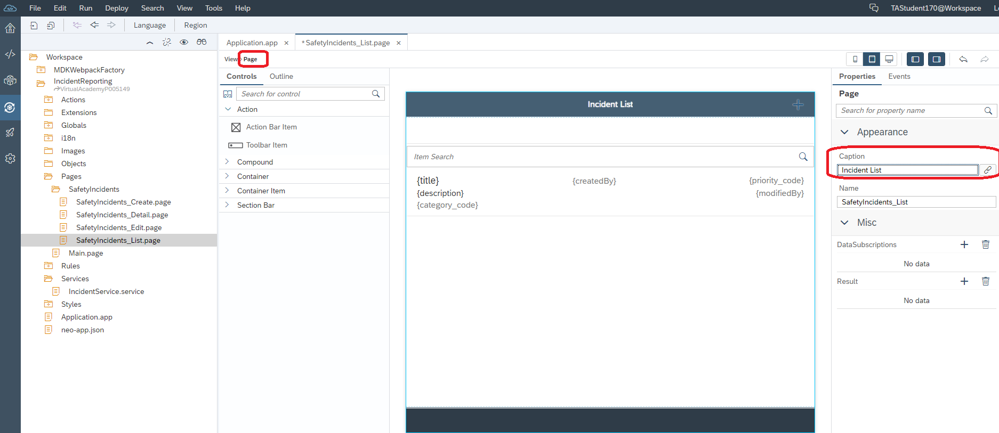
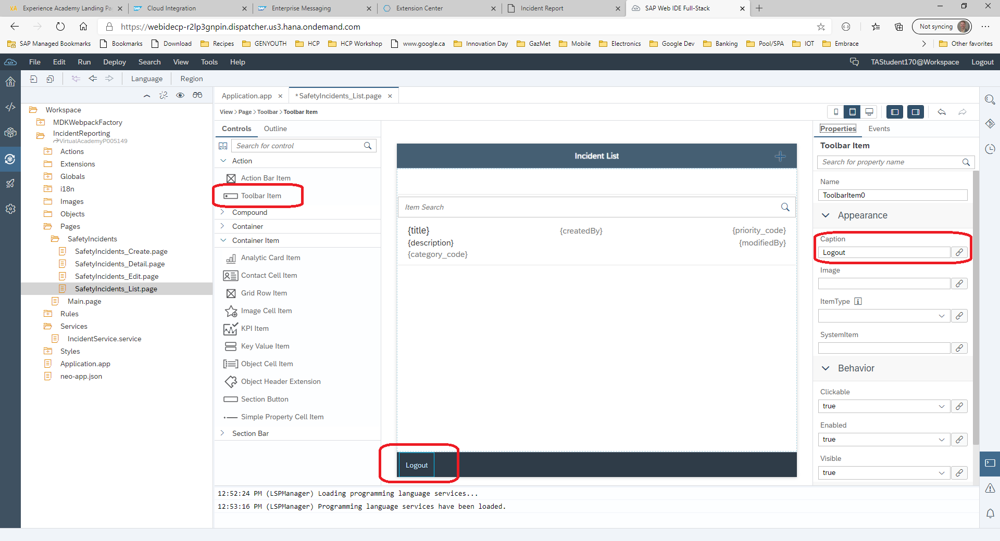
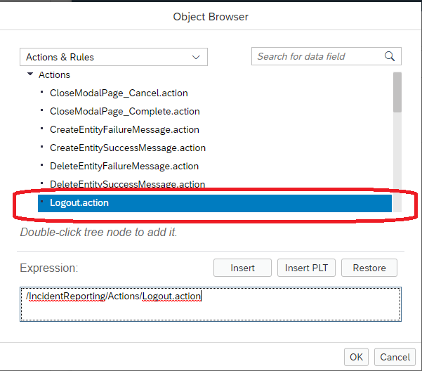
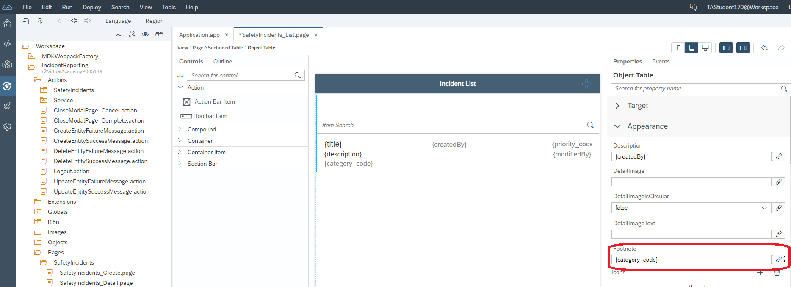
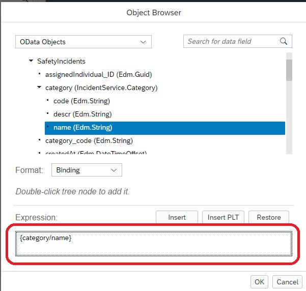
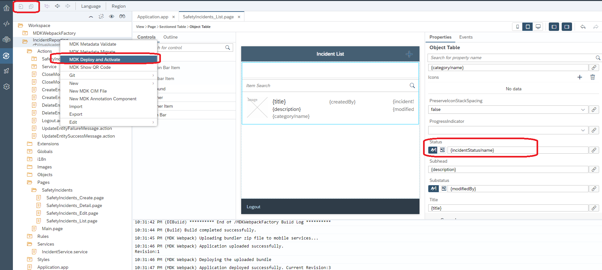

# Adding a little bit of polish to our Mobile Application

For starters, lets make the main page of our application the Safety Incident List like our UI5 application. From the Web IDE, Double Click on the Application.app to open up the editor. From here, you will be changing the page that is currently selected under for "Main Page". Open the dropdown and select SafetyIncidents_List.page.

## Now we will edit the SafetyIncident_List page

From within your project structure, expand the Pages folder followed by the SafetyIncidents folder. Double click on the SafetyIncidents_list.page to open the editor. Now we will edit a few things, notice the breadcrumb at the top where the "page" is highlighted. Click here and it will reveal the properties for the page. Modify the Caption property on the right to have an appropriate title like "Incident List".

## Time to add a footer to the page to include a Logout Button

Under the "Controls" panel, under the Action category, you will see a Toolbar Item. Drag this to the footer of the page and place it on the left side as per the screenshot. Once you drag the Toolbar Item onto the footer, you will change the caption of the button to "Logout". You will make this change on the right side of the Web IDE under the properties tab.Take note that right next to the properties tab, there is an Events tab.

Once the Logout is in place, we now need to associate an action with the Button. Actions are an important element of the MDK. Click on the Logout button and then on the right side, select the Events tab and then click what looks like a paper clip. In the Dropdown, double click the "Logout.action"

## Now we will modify the query options for the table control

From the SafetyIncidents_list page, click on the table control. Once it's highlighted, you will see a section on the right of the screen where properties can be modified for QueryOptions. As we did in the previous example, click on the paper clip symbol so that we can fine tune the data available to the data control.

Once the options panel opens up, you will select 4 options within the Expand group.
- Category
- Priority
- IncidentStatus
- IncidentPhotos

Under the orderBy, you will select CreatedAt and click the arrow so that it is ordered in descending order.

With the query options modified and saved, now we will change some of the names displayed in our table. Instead of the code names, we will use the actually name. For starters, we will modify the "Footnote" property to display the Category Name instead of the Category Code. On the right side, click on the paper clip associated with the FootNote property.

Once the object browser is open, scroll down under SafetyIncidents and within the category folder, double click the name property. Make sure it shows up in the expression box as shown below.

**Repeat the exact same procedure for the status field**

## Deployment Time to see our changes

Now, it's simply a matter of deploying our changes. Because all of our config was made earlier and we have enabled the mobile update feature, deploying the latest versions will automatically prompt the user to update.

Congratulations...you have built and deployed a mobile application that permits the creation,reading, updating and deleting of safety incidents. From here, incidents created via the mobile device should also now appear in your Fiori Inbox provided you give them the title of "**P00XXXX**. All you need to do is start your mobile application and it should prompt you to confirm the latest changes.

