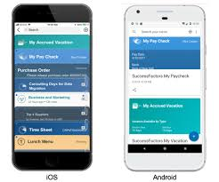

# SAP Cloud Platform Mobile Services
As part of SAP's mobile strategy, we have 3 distinct mobile offerings that are contained within mobile Services:
- Mobile Cards
- Mobile Development Kit
- iOS SDK / Android SDK

## Mobile Cards
As part the mobile cards strategy, SAP provides a client called SAP Mobile Cards and you can check out the developer tutorials here:

https://developers.sap.com/tutorials/cp-mobile-cards-setup.html

Here you can see the Mobile cards client, it's essentially for the development and delivery of micro applications. Applications that are limited in complexity but well suited to 1 small form, think Approvals as the perfect use case. Cards can be pushed using Mobile Services and users can subscribe to the cards that are interesting to them.

## iOS SDK and Android SDK

A 2nd pillar of the mobile services strategy is the Apple iOS SDK and the Android SDK. Details concerning the Apple iOS SDK and the Android SDK can be found at the following links:
- https://developer.apple.com/sap/
- https://developers.sap.com/topics/cloud-platform-sdk-for-android.html

## Mobile Development Kit

The 3rd pillar and the one we will use for this exercise is the SAP Mobile Development Kit. The Mobile Development Kit is a framework for mobile development that is provided by SAP for the creation of Mobile Applications that can be configured in a Web Browser and then run as native application on both Android and Apple devices. 

[Next Exercise](Part1.md)
