# Modify your SAPUI5 Application

You are now able to visualize a list of incidents and its details. In this section you will learn how to modify the application interface to make it more user-friendly as well as adding other funtionality to create new incidents.

In order to make this tutorial as short as possible, the SAP team already created some files you can reuse to build your app. If you want to know more about the code you will be modifying, you can find a thorough explenation [here](Code%20explanation%20-%20part%202.md)

## Step 1: Copy new files

1. In Explorer, go to **IncidentReportP00XXXX > webapp > view**, right click on  **view** folder and select **Upload Files...**

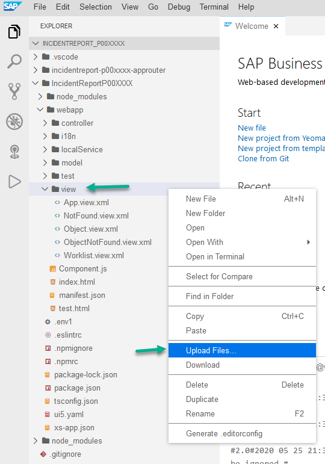

2. From the documents you downloaded, open **view** folder, select all the files and click **Open**.

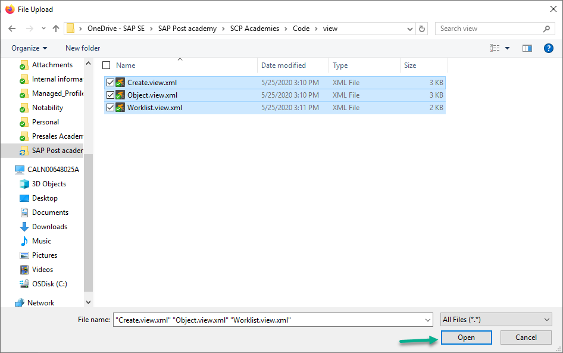

3. We will repeat the previous two steps for **controller**, **model** and **i18n** folders. Right click on them, select **Upload Files...** and choose the files inside the corresponding folder from the documents downloaded previously.

Once this is done, explorer view should look like this:

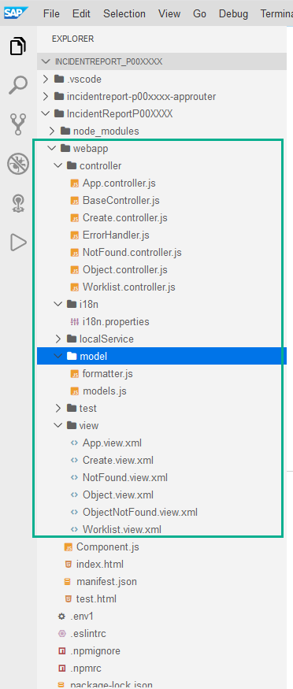

## Step 2: Change user ID in view files.

We just copied a few teamplates which have generic user, we will now change to reflect you I user.

1. Go to **IncidentReportP00XXXX > webapp > view**, right click on **Worklist.view.xml** and select **Open With > Code Editor** 

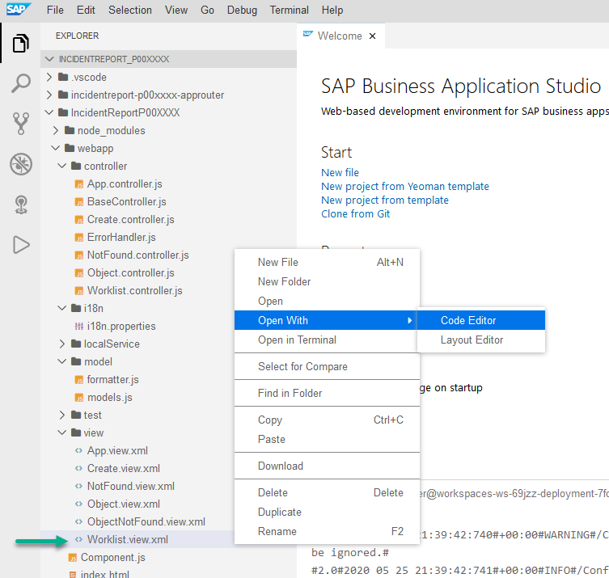

2. *On line 2* replace P00XXXX with your P number.

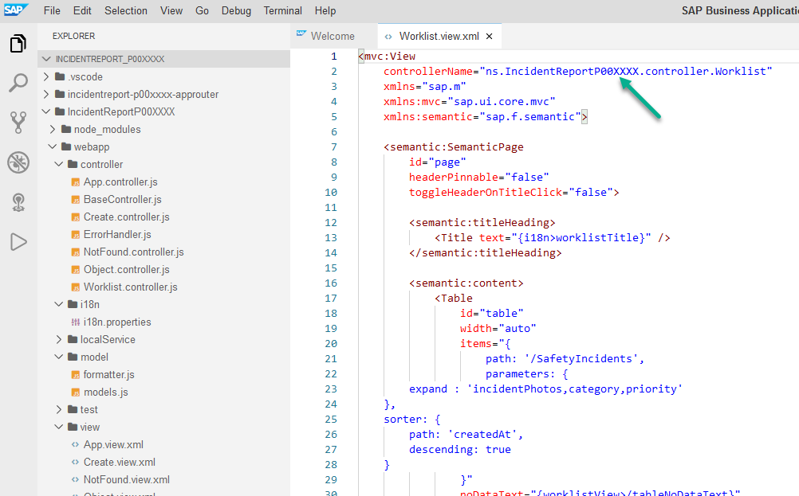

3. Repeat the previous two steps for files **Object.view.xml** and **Create.view.xml**

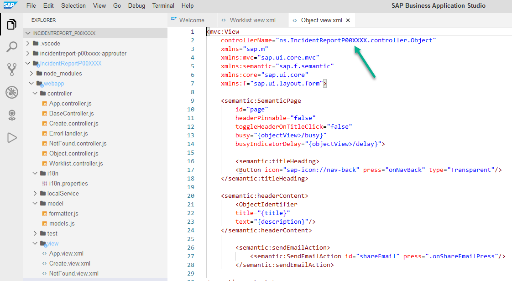

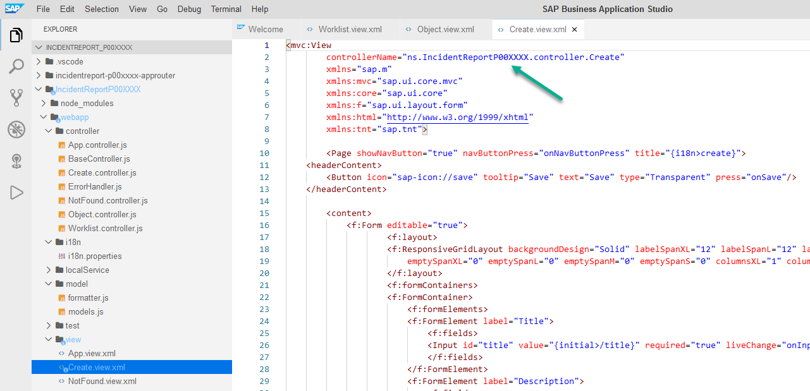

## Step 3: Change user ID in js files.

1. Go to **IncidentReportP00XXXX > webapp > controller** and open **Create.controller.js** file.

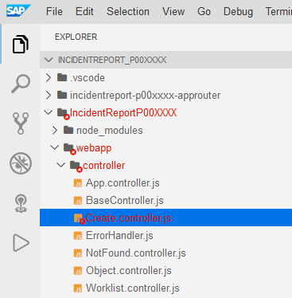

2. *On line 17* replace **P00XXXX** with your P number.

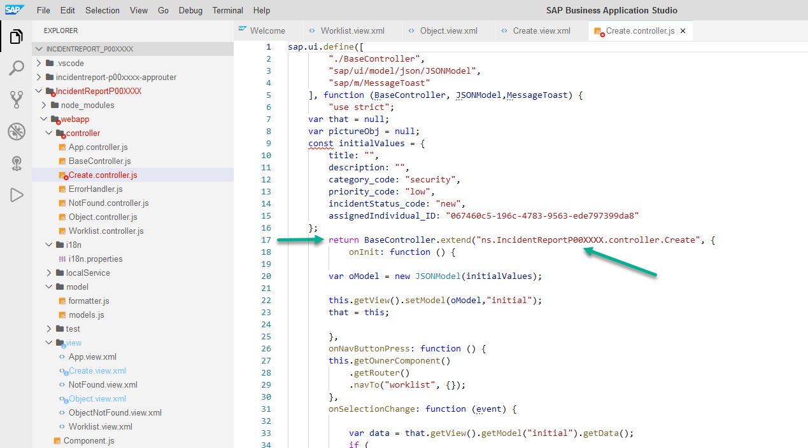

3. Scroll down and do the same *on lines 115, 164 and 199*. In addition, replace the *x* in **master_x_incidentservice** with your tenant ID (a, b, c or d).

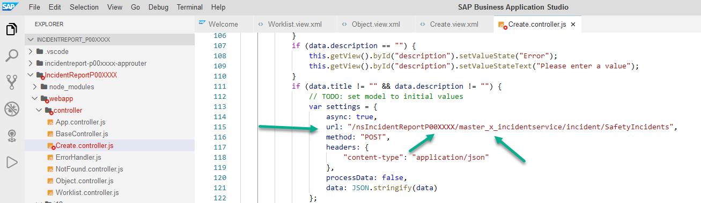

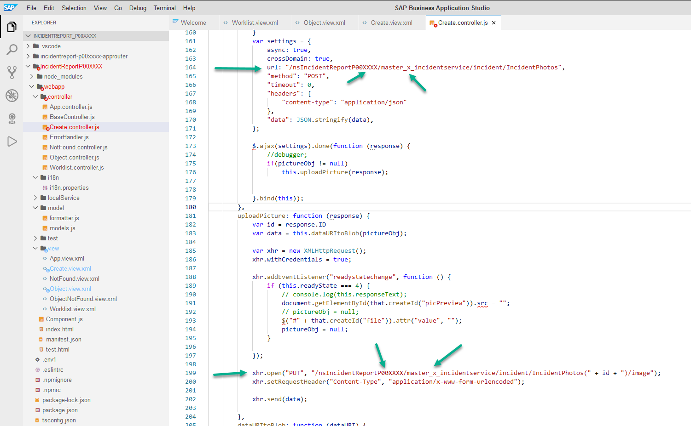

4. Go to **IncidentReportP00XXXX > webapp > model** and open **formatter.js** file.

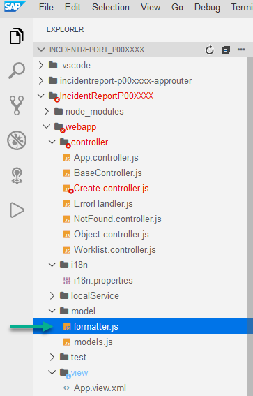

5. *On line 14*, replace **P00XXXX** with your P number. In addition, replace the *x* in **master_x_incidentservice** with your tenant ID (a, b, c or d).

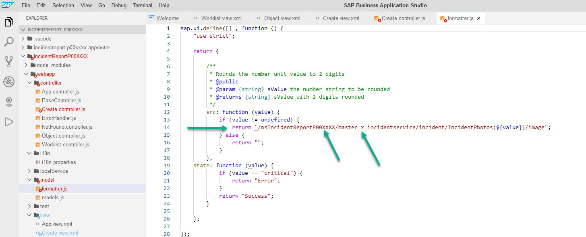

> Note: Don't forget to save your changes. Go to **File > Save All**.

## Step 4: Add application header and create button

In this section, we will add a fixed header to the entire application within which we will include an _add_ button that will open our _Create_ view.

1. We will use _App view_ which is the main application container. Right click on **App.view.xml > Open With > Code Editor** 

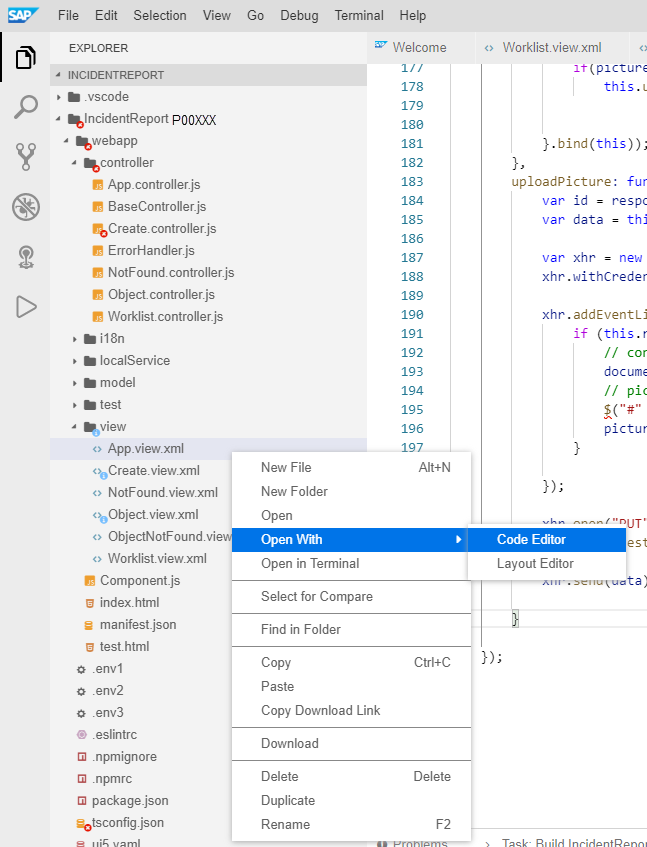

2. In _App view_, we will add a header but first we need to add an additional library. Right after *xmlns:mvc="sap.ui.core.mvc"* and before *>* press enter and pase the code below:

```xml
	xmlns:tnt="sap.tnt"
```
Above ```<App id="app"/>``` paste the code below:

```xml
	<tnt:ToolHeader id="nav">
		<Image src="https://www.sap.com/dam/application/shared/logos/sap-logo-svg.svg.adapt.svg/1493030643828.svg" width="50px"></Image>
		<Text text="{i18n>appDescription}" wrapping="false"/>
		<ToolbarSpacer/>
		<Button type="Transparent" icon="sap-icon://add" press="toCreate"></Button>
	</tnt:ToolHeader>
```
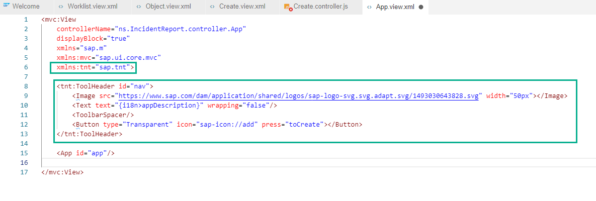

On *line 9*, we added an logo to our header, please feel free to use your company logo. 

*Line 12* added a button that will trigger the navigation to the _Create view_

3. Open **App.controller.js**

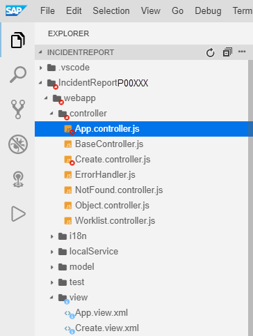

4. Please add the code below, after _onInit_ function, *on line 11* after the braket (**don't forget to include the comma at the beginning**):

```javascript
	,
        toCreate: function () {
			// apply content density mode to root view
			this.getOwnerComponent()
				.getRouter()
				.navTo("RouteCreate", {});
        }
```
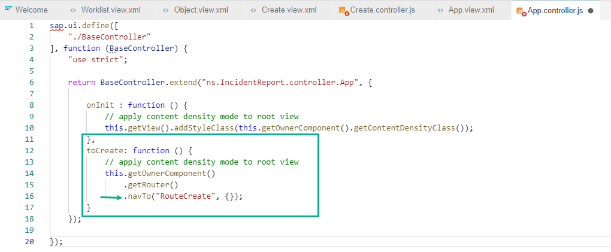

On *lines 14 to 16* we navigate to a route called _RouteCreate_. This route does not exist yet, we will add it in the next step.

## Step 5: Add route and target

In this section, we will define a route that will tell our application how to navigate from one view to another.

1. Open the **manifest.json**


2. Scroll down until _routes_ section and right after the last bracket (line 110), add a new route (**don't forget to include the comma at the beginning**)

```javascript	
	,
        {
			"name": "RouteCreate",
			"pattern": "create",
			"target": [
				"create"
			]
	}
```
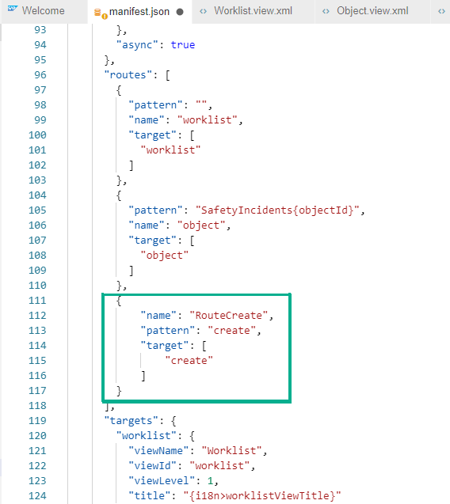

This route indicates the app must jump to a target called _create (line 115)_

3. Scroll further down until you see targets and add a new target Copy the code below *on line 139* after the braket (**don't forget to include the comma at the beginning**)

```javascript
	,
        "create": {
          "viewName": "Create",
          "viewId": "create"
        }
```
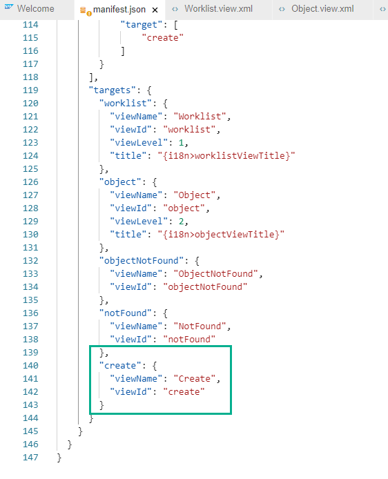

4. After creating a new incident, we want our worklist to be refreshed automatically, therefore we will add a refresh instruction after the main view is called again.

Go back to **Worklist.controller.js**.

Inside _onInit_ function, *on line 37*, please add:

```javascript
	this.getOwnerComponent().getRouter().getRoute("worklist").attachPatternMatched(this._onObjectMatched, this);
```
After _onInit_ funtion, *on line 39* please add:

```javascript
	_onObjectMatched : function (oEvent) {
                //debugger;
                this.getView().byId("table").getBinding("items").refresh();
        },
```
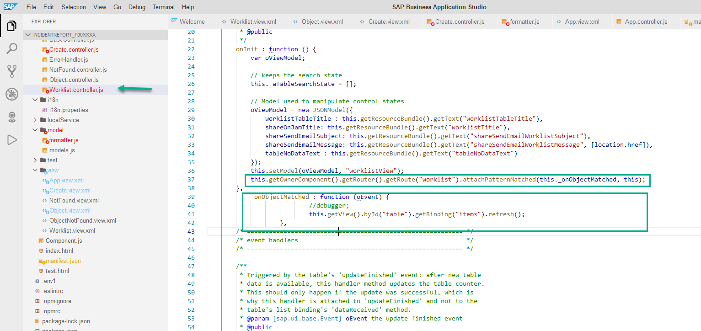

On *line 37* we attached a new event that will be triggered when the view is called from another view. *Line 39* will refresh the table content to show the most recent incident created.

> Note: **DON'T FORGET TO SAVE YOUR CHANGES. PLEASE GO TO File > Save All**

5. Refresh the application preview to see your changes.


Congratulations!. You have successfully completed part 2.

[Next Exercise](Part%203%20-%20Add%20a%20chatbot%20to%20your%20SAPUI5%20app.md)
