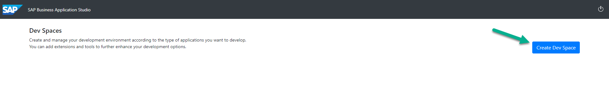
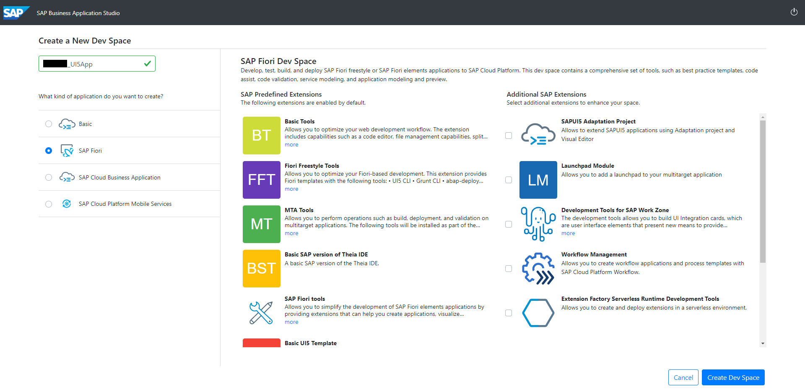

# README
In this section, we will create an UI5 application that will be consuming the back-end services created in week 1. 

## Step 1 - Download required files

Please go to https://sap-my.sharepoint.com/:f:/p/bruno_guerrero/EtDsb7rPTZBMuGBZhjAp5JwBX-MhbaLPyymp6CkS3dGrgA?e=71vns9 , download and save the files in your computer.

## Step 2 - Access the TA Landing Page

**(At this point, you should have a dedicated user)**

Open a New Browser Window and use the following Link:

https://virtual-scp-roadshow.cfapps.eu10.hana.ondemand.com

For this scenario, we will be using the new Business Application Studio so click on the "Let's Go" within the BAS Tile

You should be prompted with a screen like this one where you will now create a Dev Space by clicking the "Create Dev Space" Button.

From here, you will select the SAP Fiori Template and provide a name for your Dev Space. We would suggest you make this name unique by including your UserName in the name and append UI5App. After you specify the name, click the button "Create Dev Space"

After 1-2 minutes, you should see the status of your creation change from started to running which means your Dev Space is now ready.

Once the Dev Space, says RUNNING, you will see that the Dev Space Name becomes clickable (far left of screen next to the cloud symbol). Click on the name to open it and proceed to use Business Application Studio. If you are ready to continue, click here to jump to the next exercise:

[Next Exercise](Part%201%20-%20Create%20Worklist%20Application.md)
