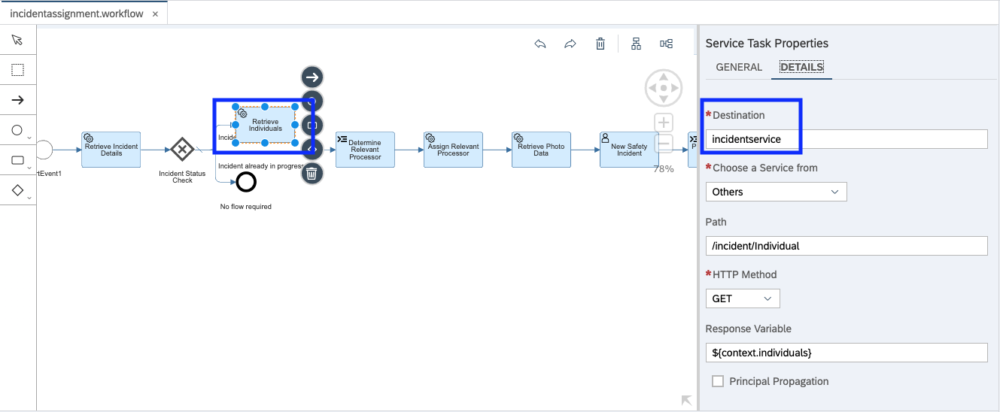
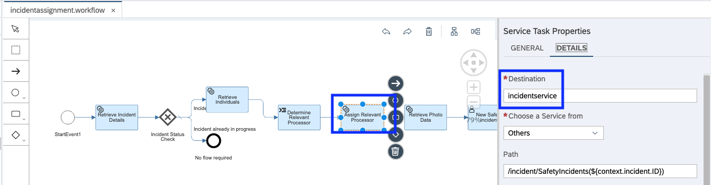
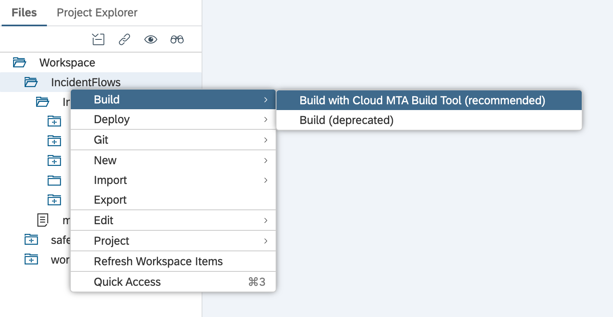
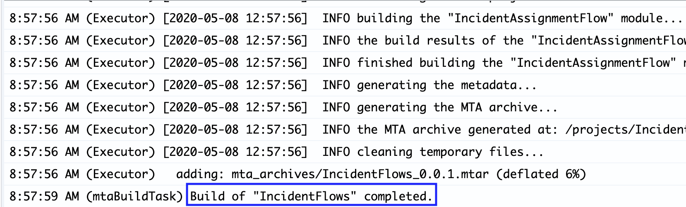
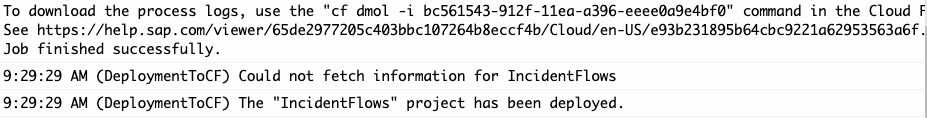

## Modify the workflow to access your Safety Incident Service

Before proceeding, please speak with your instructor to ensure that an SCP destination has been created for your service you created in week one. Currently you are using a generic test service created by Scott Dillon's Garage series http://bit.ly/SCPGarage2020. 

If you are on week two of this session, do not make this change yet. Once you have created the Service Incident UI5 application in a few weeks, you can come back to this step to modify your workflow to have access to your Safety Incident service.

**For now, there is nothing to do, continue to use the generic testing UI and the generic test service**

## When you are ready to point the workflow to your service - proceed

When we look at the workflow **incidentassignment.workflow** under the incidentFlows package, there are five areas (service tasks) where you have to change the destination from **incidentservice** to **P00XXXX_incidentservice**. Pay attention to upper and lowercase, the changes must be entered in the correct case as described above.

### Retrieve Incident Details

### Retrieve Individuals

### Assign Relevant Processor

### Retrieve Photo Data

### Update Incident
  
 
  
## Rebuild and Deploy

Once you have made these changes, you must rebuild and deploy your changes to cloud foundry.

### Build 

Right click on the **IncidentFlows | Build | Build with Cloud MTA Build Tool** 

 

You should now see "Build of IncidentFlows completed."

### Deploy 

Open the folder **mta_archives** 

 

Right click on **IncidentFlows_0.0.1.mtar | Deploy | Deploy to SAP Cloud Platform** 

 

You should now see "The IncidentFlows project has been deployed."

 

Congratulations, the workflow is now pointing to your Safety Incident Service. Try creating new Service Incidents and see them in your workflow.

