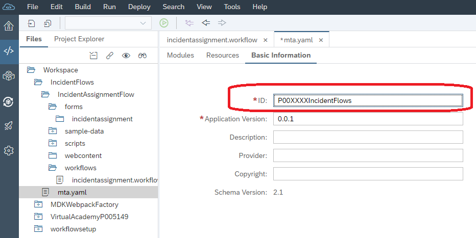

## Lets get started - Set Up Workflow on SAP Cloud Platform

In this section you will: 
  
  * Configure WebIDE to work with the Workflow service 
  * Download the sample Safety Incident Management workflow that has been prebuilt for this exercise.
  * Import the applications into the SAP Cloud Platform Web IDE.
  * Learn about the deployment descriptor (mta.YAML) files by making changes to them.

## Step 2 Download sample application files

A sample application has been created for the workflow exercise. This application will be used for the workflow exercise to model your workflow and it will be deployed to Cloud Foundry.

Click on the following links to download the files to your local computer. Remember the location - you will need them soon.
* [IncidentFlows](Appendix%20-%20Downloads/IncidentFlows.zip?raw=true)

These files are located in github - [Workflow - Appendix Downloads](Appendix%20-%20Downloads)

## Step 3 Access SAP Web IDE

In order to access the SAP Web IDE, we must return to the landing page. We used it in Week 1 but have included the link here for ease of reference:
In your web browser, **right click** on the following link a select "Open Link in New Tab" https://virtual-scp-roadshow.cfapps.eu10.hana.ondemand.com. 

*LATAM*

If Your userid is between P005557 - P005587
https://xa-EA0554.cfapps.eu10.hana.ondemand.com

If your userid is between P005588 - P005618
https://xa-EA0556.cfapps.eu10.hana.ondemand.com

If your userid is between P005650 - P005680
https://xa-EA0558.cfapps.eu10.hana.ondemand.com

Take note of the section in the middle of the screen **"Platform User"**. When you logon to SAP Cloud Platform, we have mapped your id to a platform user. During the exercise you may be asked for the platform user. Refer to this landing page to get the user and password. If you have a question, ask your instructor.


In the lower right hand corner, you will see the Web IDE tile. Press the Web IDE "Let's Go!" button. This will launch the SAP Cloud Platform WebIDE.

In the navigation area of **SAP Web IDE**, Choose the **Preference** icon.


Select the **Extensions** preference and search **workflow** 

Click the toggle button to switch on the **Workflow Editor** extension and **Save** the changes.
  * Click **Refresh** to apply the changes.
  
  

Select **Cloud Foundry** Preference.

The cloud foundry preferences are required by WebIDE when the Workflow will be deployed. The workflow package will build a Multitarget package. This deployment unit will be deployed to the Cloud Platform runtime.

When you are connecting and deploying to Cloud Foundry, you must use the **Platform user and Password**. These users have been setup specifically for this purpose. note: Your platform user is on the landing page when you first logged on.

In the credentials popup, enter your associated platform user and platform user password.
  **Note: This is not your PUser P000XXX**


then **Save** the changes

## Step 4 Import Sample Workflow

For this course we will be sharing the same Workflow service and Launchpad service. As part of the exercise, you will be modifying the workflow definition so that you can identity it once it's deployed.

In the navigation area of the **SAP Web IDE**, choose the **Development** icon. Right click on **Workspace** and click **Import** 


In the Import dialog, browse for the **IncidentFlows.zip** file that you downloaded in your local system and choose **OK**.


  
## Step 5 Update Deployment Descriptors (mta.yaml)

### Update Deployment Descriptors

A very important part of understanding and using SAP Cloud Platform is the notion of an MTA. The definition of an MTA as per the documentation is:
**A multi-target application (MTA) is comprised of multiple parts (modules), created with different technologies and deployed to different targets, but with a single, common lifecycle.**

An MTA is logically a single application, consisting of multiple related and interdependent parts that are developed using different technologies or programming paradigms and designed to run on different target runtime environments, with a single, consistent lifecycle. 

The MTA deployment descriptor defines the prerequisites and dependencies for the deployment of a multi-target application. The deployment description is specified in an mta.yaml file.

```

Take a look at the files you have just imported. Find the mta.yaml file. 
You will now be updating the deployment descriptor.

The mta.yaml file is used by cloud foundry during deployment.

```
#### IncidentFlows 

The IncidentFlows project contains the Safety Incident Workflow artifacts. 

We will now inspect the deployment descriptor that is contained in the **mta.yaml** file. 

**Double click on the mta.yaml file under the incidentFlows project.**

Refer to the top of the screen - click on *Basic Information*

We will change update the ID to include your Userid - change the 4 XXXX to your userid..



Refer to the top of the screen - click on the *Resources* tab.


This section is used to determine what services must be deployed with the workflow. In this case, you see a reference wf-service. This is the name of the default workflow service and you will notice it is configured as an existing service. 

 

Take a look around your mta.yaml file in the editor. 

  * Take a few minutes to look at the yaml file. This workflow service depends on the resource 'wf-service'. 
  * The workflow service has been deployed prior to the session but it's important to understand how to specify required services. If you execute a 'cf services' command from a terminal window within BAS, you should see the wf-service returned in the list. 
  
You will give your workflow a unique ID so that your workflow is easy to find and has a uniqueID. 
- Within the IncidentAssignmentFlow, expand the workflows folder
- Right click on the workflow ***incidentassignment.workflow** and click on ***open code editor*
- Change name by changing the XXXX to your userID at beginning
- Change id by changing the XXXX to your userID at beginning


*Save your changes *

Double click on the **incidentassignment.workflow** file to see the visual representation of the workflow. Click on the whitespace on the screen and you should see the **Workflow Properties** tab on the right. Your screen should show the XXXX replaced by your userid.


Congratulations, you have completed the steps to setup WebIDE. 

[Next](Part%202%20-%20Safety%20Incident%20Workflow%20Design.md) 
