## Lets get started - Set Up Workflow on SAP Cloud Platform

In this section you will: 
  
  * Configure WebIDE to work with the Workflow service 
  * Download the Safety Incident Management applications that have been prebuilt for this exercise.
  * Import the applications into the SAP Cloud Platform Web IDE.
  * Learn about the deployment descriptor (YAML) files by making changes to them.

## Step 2 Download sample application files

Two sample applications have been created for the workflow exercise. These applications will be used for the workflow exercise to model your workflow, create the Fiori Launchpad and create the required service instances.

Click on the following links to download the files to your local computer. Remember the location - you will need them soon.
* [IncidentFlows](Appendix%20-%20Downloads/IncidentFlows.zip?raw=true)
* [workflowsetup](Appendix%20-%20Downloads/workflowsetup.zip?raw=true)

These files are located in github - [Workflow - Appendix Downloads](Appendix%20-%20Downloads)

## Step 3 Access SAP Web IDE

In your web browser, **right click** on the following link a select "Open Link in New Tab" https://virtual-scp-roadshow.cfapps.eu10.hana.ondemand.com. 

Take note of the section in the middle of the screen **"Platform User"**. When you logon to SAP Cloud Platform, we have mapped your id to a platform user. During the exercise you may be asked for the platform user. Refer to this landing page to get the user and password. If you have a question, ask your instructor.

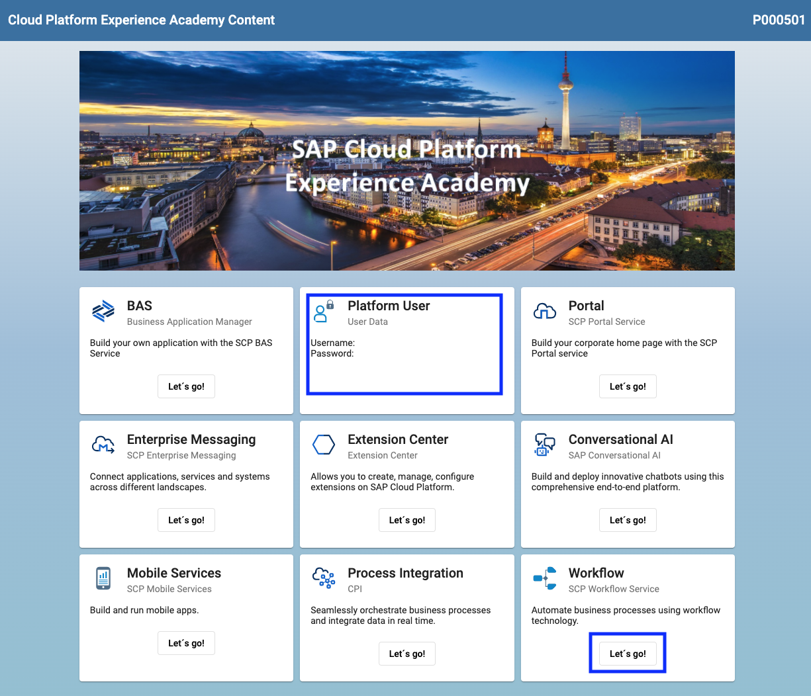

In the lower right hand corner, you will see the Workflow tile. Press the Workflow "Let's Go!" button. This will launch the SAP Cloud Platform WebIDE.

In the navigation area of **SAP Web IDE**, Choose the **Preference** icon.

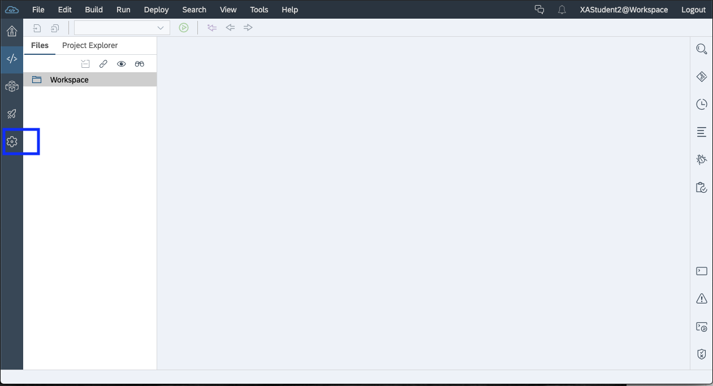

Select the **Extensions** preference and search **workflow** 

Click the toggle button to switch on the **Workflow Editor** extension and **Save** the changes.
  * Click **Refresh** to apply the changes.
  
  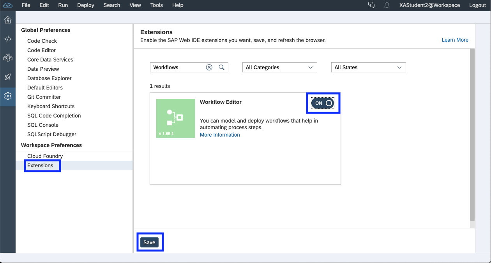

Select **Cloud Foundry** Preference.

The cloud foundry preferences are required by WebIDE when the Workflow will be deployed. The workflow package will build a Multitarget package. This deployment unit will be deployed to the Cloud Platform runtime.

There are four groups listed below. Each group has thirty users in the group. find your group and then use the configuration associated with the group when linking the WedIDE to your cloud foundry space. It is important that you use the correct group.

| ID Range | API End Point | Organization | space | 
| ------------- | ------------- |------------- |------------- |
| P005001 to P005035 | https://api.cf.eu10.hana.ondemand.com |  SE Technical Academy_vr-a-cf-eu10 | dev |
| P005036 to P005070 | https://api.cf.eu10.hana.ondemand.com |  SE Technical Academy_vr-b-cf-eu10 | dev |
| P005071 to P005105 | https://api.cf.eu10.hana.ondemand.com |  SE Technical Academy_vr-c-cf-eu10 | dev |
| P005106 to P005140 | https://api.cf.eu10.hana.ondemand.com |  SE Technical Academy_vr-d-cf-eu10 | dev |

When you are connecting and deploying to Cloud Foundry, you must use the **Platform user and Password**. These users have been setup specifically for this purpose. note: Your platform user is on the landing page when you first logged on.

In the credentials popup, enter your associated platform user and platform user password.
  **Note: This is not your PUser P000XXX**

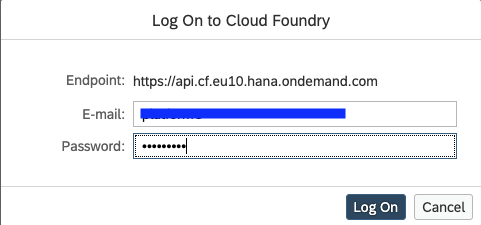

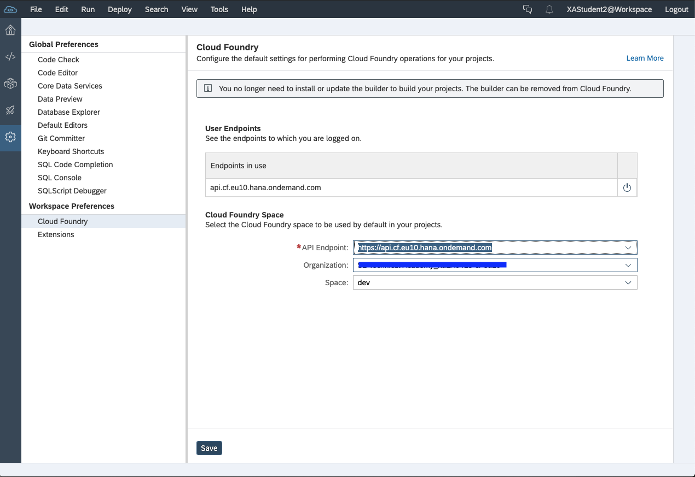

then **Save** the changes

## Step 4 Import Sample Workflow and Fiori Launchpad applications

We have provided two sample applications for workflow and the Fiori launchpad. For this course we are sharing one Workflow service, so we have to make some changes to the applications so each deployment is unique.

In the navigation area of the **SAP Web IDE**, choose the **Development** icon. Right click on **Workspace** and click **Import** 

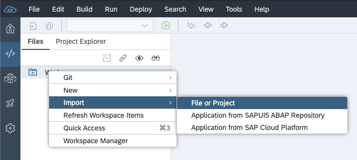

In the Import dialog, browse for the **IncidentFlows.zip** file that you downloaded in your local system and choose **OK**.

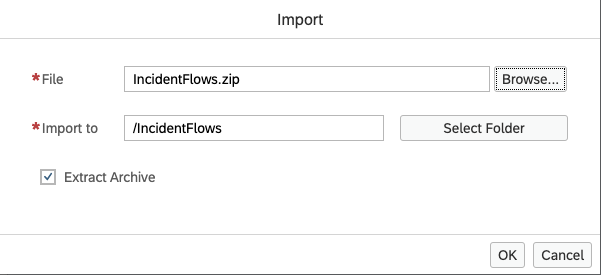

Now import the **workflowsetup.zip** file

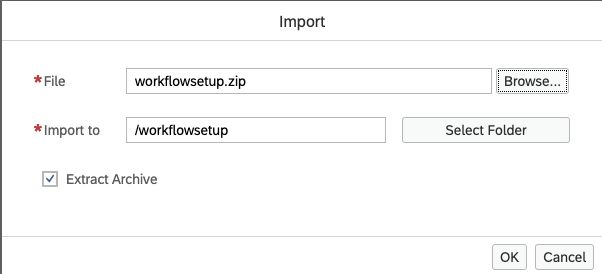

The application gets imported under the **Workspace** folder and the file structure is shown below. 
  
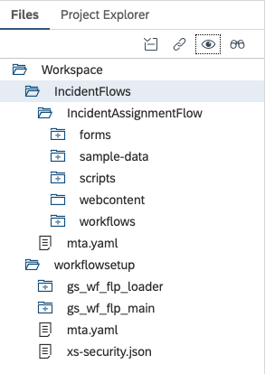
  
## Step 5 Update Deployment Descriptors (mta.yaml)

### Update Deployment Descriptors

A very important part of understanding and using SAP Cloud Platform is the notion of an MTA. The definition of an MTA as per the documentation is:
**A multi-target application (MTA) is comprised of multiple parts (modules), created with different technologies and deployed to different targets, but with a single, common lifecycle.**

An MTA is logically a single application, consisting of multiple related and interdependent parts that are developed using different technologies or programming paradigms and designed to run on different target runtime environments, with a single, consistent lifecycle. 

The MTA deployment descriptor defines the prerequisites and dependencies for the deployment of a multi-target application. The deployment description is specified in an mta.yaml file.

```

Take a look at the files you have just imported. Find the mta.yaml file for each project. 
You will now be updating the deployment descriptors in the MTA files.

The mta.yaml files are used by cloud foundry during deployment.

```

#### workflowsetup project 

The workflowsetup project contains the Fiori Launchpad which will be deployed on cloud foundry.

The folders in the project have to be renamed. replace **gs** with your user ID (P00XXXX) but keep the rest of the folder name. 

Right click on the folder **gs_wf_flp_loader** and select **Rename**. change the name to **P00XXXX_wf_flp_loader** where P00XXXX is your P number.

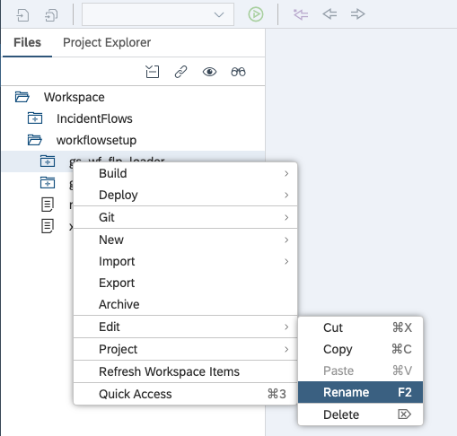

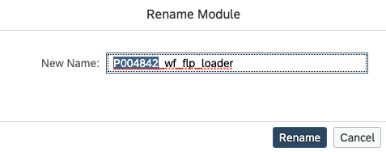

Now do the same thing for the folder **gs_wf_flp_main**

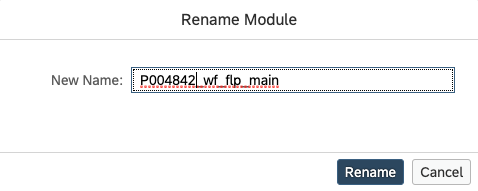

Here is what the folder structure will look like when you are done (note: P004842 will be replaced by your user ID)


We will now modify the deployment descriptors that are contained in the **mta.yaml** file. you will replace **'gs'** with your user ID (P00XXXX). Take care to only replace 'gs'.

**Please pay attention to upper and lower case. This is important**

Double click on the mta.yaml file under the workflowsetup project. This will open the mta editor, which supports a visual editing tool and a file-based editor. You can toggle between the visual and file-based editor at the bottom of the screen.

Refer to the top of the screen - we will be modifying the resource names. Make sure you are on the resource tab.

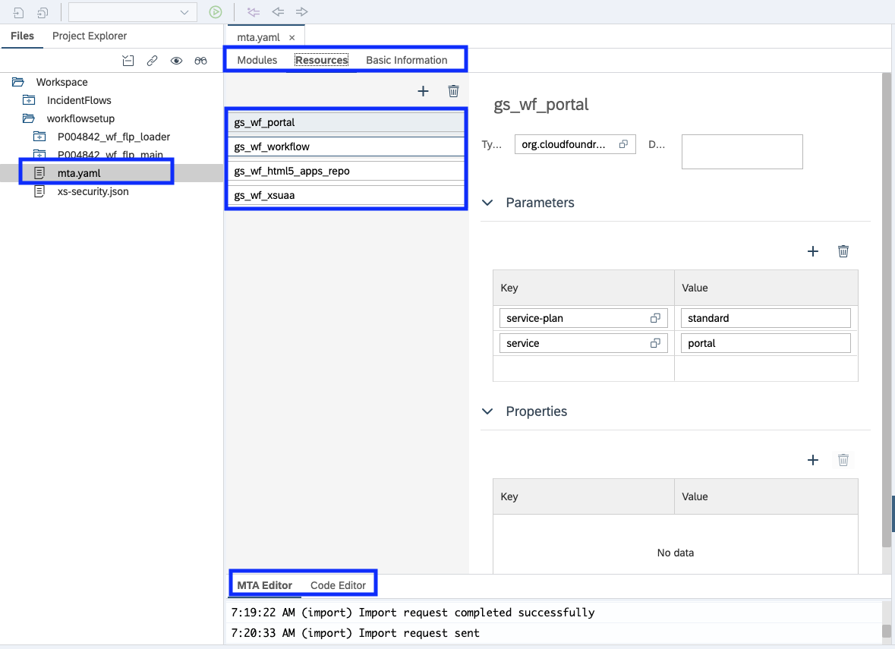

Click on "gs_wf_portal". Highlight **gs** and change to your user id (P00XXXX). Once done do the same for the remaining four entries. 

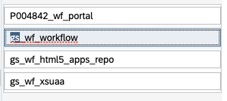

The resource names should now be prefixed with your user. 

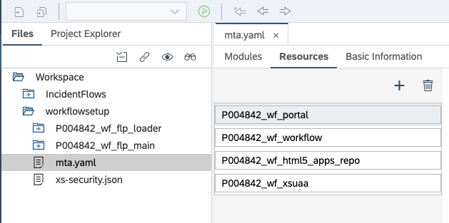

Save your changes - **hint - The save button is on the left-hand side at the top.**

Now let's change the basic information. click on the tab for "Basic Information" at the top of the screen. replace "gs" with your user ID (P00XXXX).

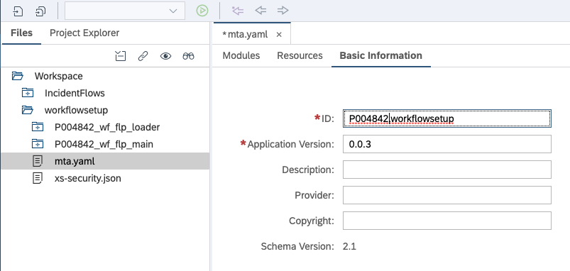

Save your changes 

Now we have to edit the file directly. Open the MTA file in "Code Editor". We will manually replace the remaining "gs" entries. Replace them with your User ID (P00XXXX)
**If you notice entries after line 30 that are still using the "gs_" prefix, change those as well**

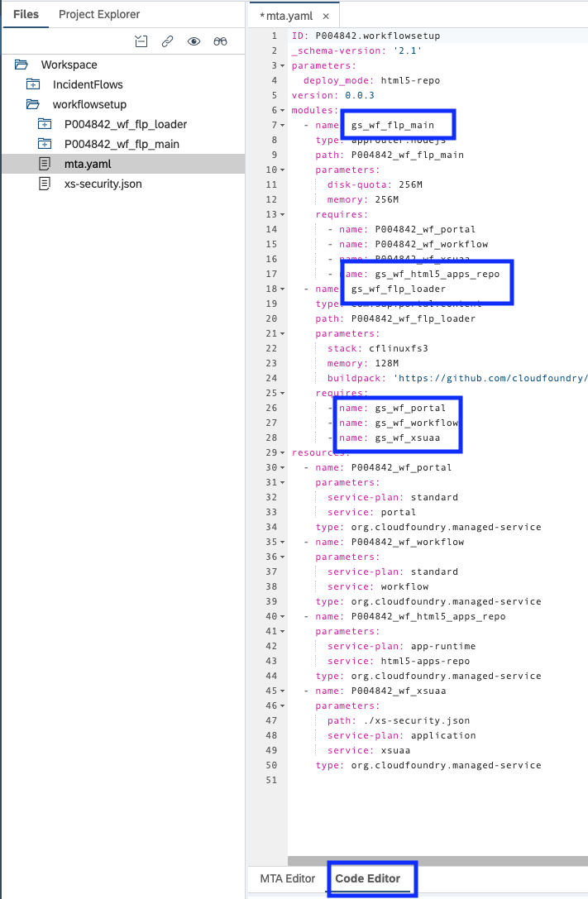

Save your changes 

Now, navigate around the MTA file. You should not see a reference to **"gs"**.

The file **xs-security.json** must now be modified. The xsappname must be unique. Append your user ID (P00XXXX) number to the end of the xsappname as indicated below.

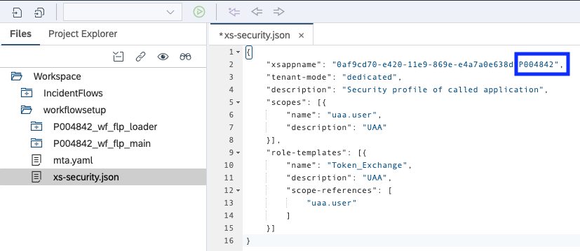

Save your changes

We have finished the required changes for the workflowsetup project

#### IncidentFlows 

The IncidentFlows project contains the Safety Incident Workflow artifacts. 

We will now modify the deployment descriptors that are contained in the **mta.yaml** file. you will replace **'gs'** with your user ID (P00XXXX). Take care to only replace 'gs'.

**Double click on the mta.yaml file under the incidentFlows project.**
Refer to the top of the screen - we will be modifying the resource names. Make sure you are on the resource tab.

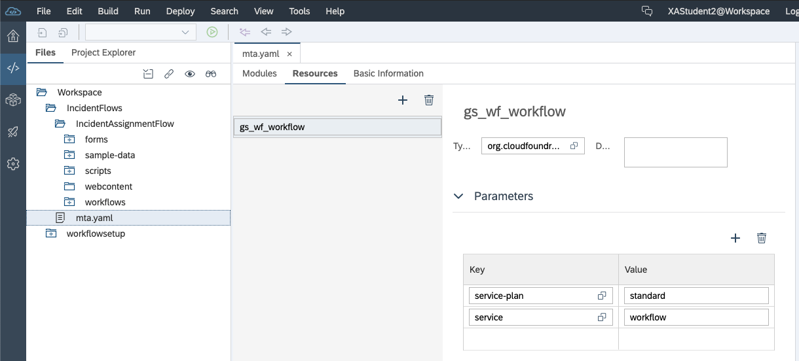

Now we will make 4 changes to this file. Click on the code editor (at the botton of the screen) :
- Line 1 Change the ID
- Line 5 Change the name
- Line 9 Replace **gs** with your user ID (P00XXXX) similar to the image below. 
- Line 16 Replace **gs** with your user ID(P00XXXX)...this should match line 9

Do not forget to save your changes.

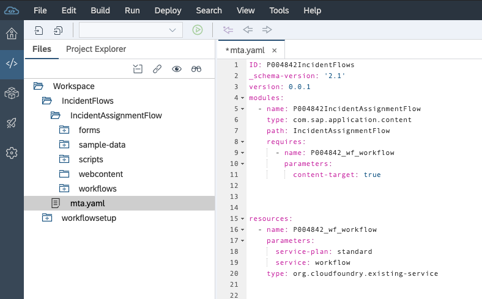

Save your changes. 

Take a look around your mta.yaml file in the editor. 

  * Take a few minutes to look at the yaml file. This workflow service depends on the resource 'P004842_wf_workflow'. If you remember this resource was deployed in the workflowsetup yaml listed above. 
    * When the workflowsetup MTA is deployed it will create an instance of the workflow service. **So the workflow setup project must be deployed first.**
    * Then when we deploy the IncidentFlows project, it will try to deploy the workflow to the workflow service that was created previously. 

You will give your workflow a unique ID so that your workflow is easy to find and has a uniqueID. 
- Within the IncidentAssignmentFlow, expand the workflows folder
- Right click on the workflow ***incidentassignment.workflow** and click on ***open code editor*
- Change name by adding userID at beginning
- Change id by adding userID at beginning

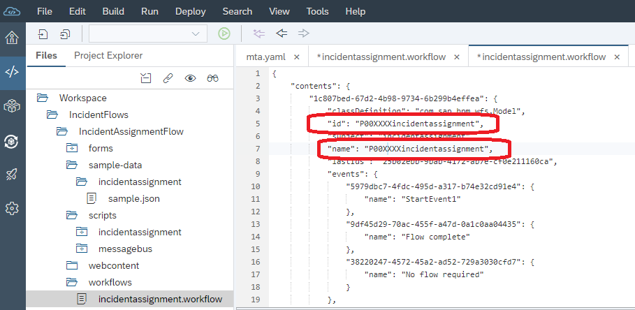

*Save your changes *

Double click on the **incidentassignment.workflow** file to see the visual representation of the workflow. Click on the whitespace on the screen and you should see the **Workflow Properties** tab on the right. You should see the changes you just made.

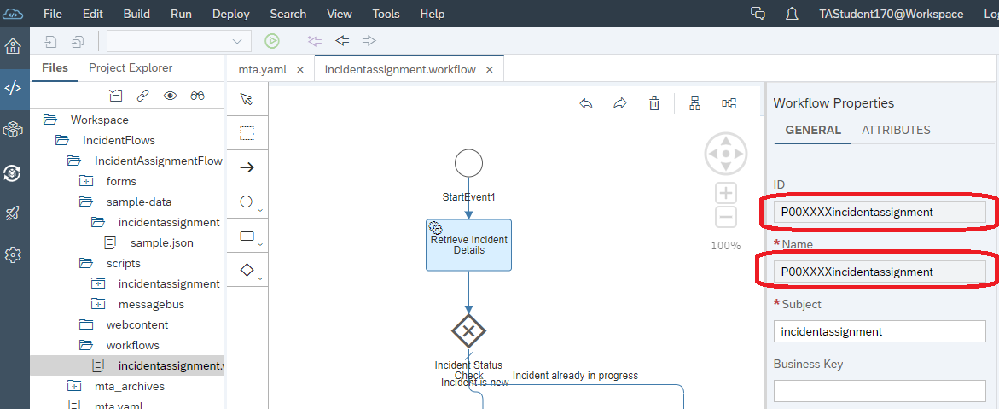

Congratulations, you have completed the steps to setup WebIDE. 

[Next](Part%202%20-%20Safety%20Incident%20Workflow%20Design.md) 
