## The Safety Incident Workflow - Build and Deploy

In this section you will Build and Deploy your projects to SAP Cloud Platform. 

So far you have :
  * Configured the WedIDE to import sample projects and modify the deployment descriptors to ensure we have our own instance of the workflow.
  * Next we walked through the key areas of the workflow to understand how a workflow can call a service 
  * You then Added a form based UI to the workflow to capture comments from the security officer when the process the workflow
  * Now is the big test - we will build and deploy your workflow to SAP Cloud Platform 
  
### Build

When you build and deploy this application, new service instances will be created in your Cloud Foundry subaccount. 
**Note: It make take a few minutes for the build to complete.**

Right-click on the **IncidentFlows* project. the **Build | Build with CloudMTA Build Tool (recommended)**

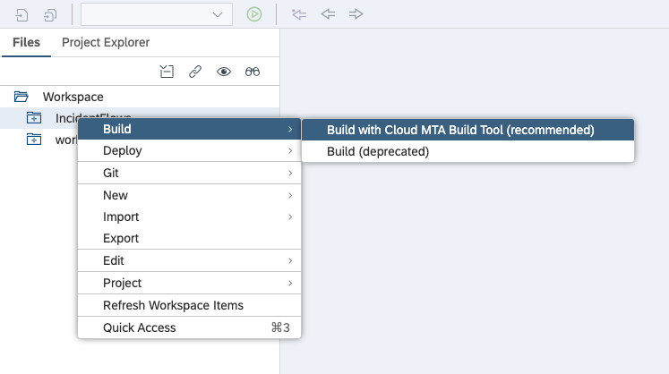

You should get the following message in the console -> **Build of "IncidentFlows" completed.** 

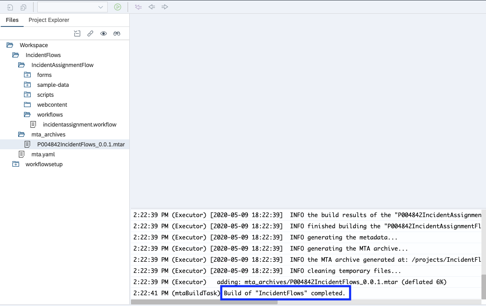

You have to do the same thing for the workflowsetup package. Trigger the build in the same way. Right click on the workflow setup package to trigger the build.

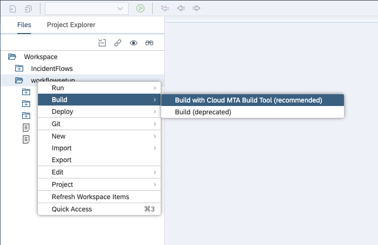

In the console you may get some warnings, do not be alarmed.

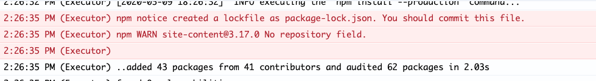

You should get the following message in the console -> **Build of "workflowsetup" completed.** 

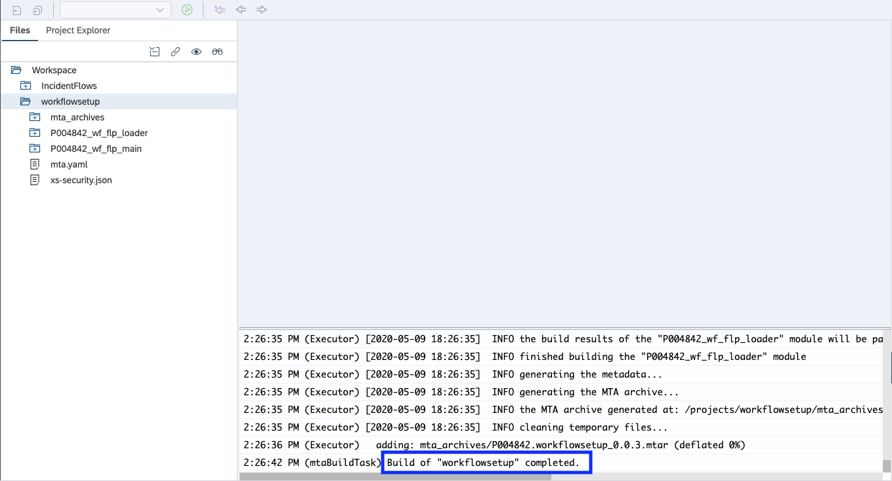

* Take a look at the folder under both projects. Look for a new folder that was just created called mta_archive. 

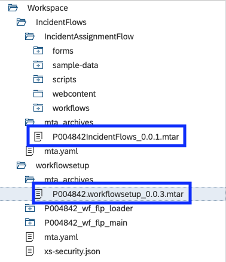

Once the build has completed for both projects, we will now deploy them. 

### Deploy

There are dependencies between the two packages that will be deployed. It is important that you deploy the workflowsetup first.

#### Step 1 : Deploy workflowsetup 

Start by deploying the workflowsetup mtar file to SAP Cloud Platform. Right click on the MTAR file and click **Deploy to SAP Cloud Platform**. 

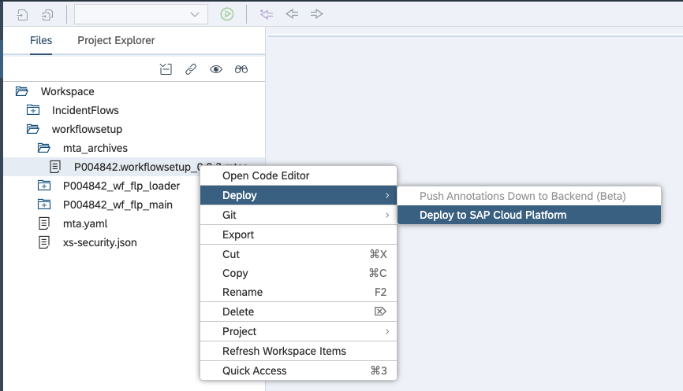

You will be prompted to select the subaccount and space. This is associated with your account. There should only be one.

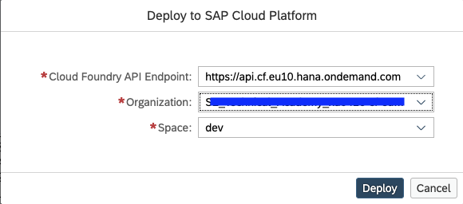

Let the build go - it may take a few minutes. The deployment descriptors we modified previously are being used by cloud foundry to configure and deploy the required services. When the package is deployed, you will get a success message.

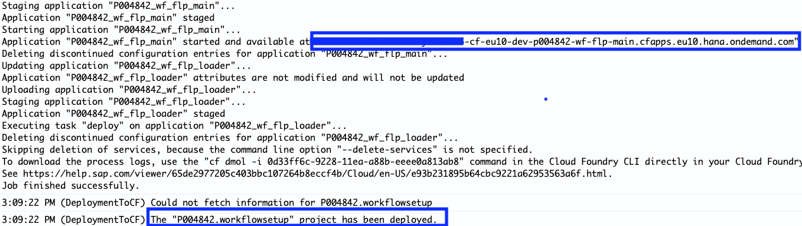

Notice the message in the log "". This is the endpoint to access your Fiori Launchpad portal. 
Copy the URL and paste it in your browser. Hit return and now you see the Fiori Launchpad.

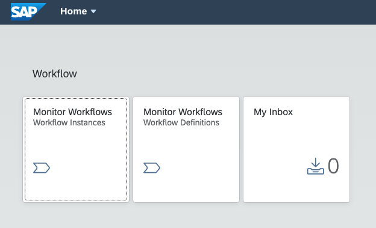

Don't spend too much time on the portal we will use it in the next section, and we still need to deploy the workflow service. 

#### Step 2 : Deploy IncidentFlows

Start by deploying the IncidentFlows mtar file to SAP Cloud Platform. Right click on the MTAR file and click **Deploy to SAP Cloud Platform**. 

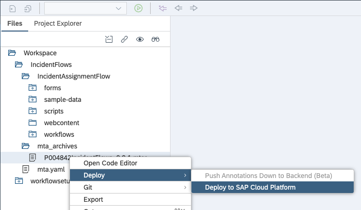

You will be prompted to select the subaccount and space. This is associated with your account. There should only be one.

Let the build go - it may take a few minutes. The deployment descriptors we modified previously are being used by cloud foundry to configure and deploy the required services. When the package is deployed, you will get a success message.

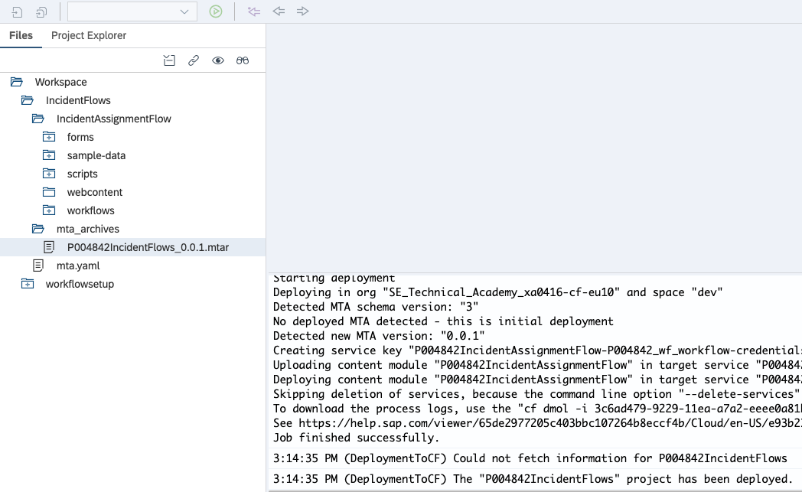

Congratulations, you have completed the steps to build and deploy the Safety Incident workflow. 

[Next](Part%204%20-%20Test%20the%20Safety%20Incident%20Workflow.md)

