## Test the Safety Incident Management Workflow 

In this section you will : 
  
  * Learn how to test the Safety Incident workflow 
  * Optional: Make changes to the workflow to point to your service that you created in week one of this technical academy
  
## Test the Safety Incident Workflow 

We have created an application to help test your workflow. Access the following link on your phone, ipad or laptop 
* [Test Application](https://se-technical-academy-xaea0415-cf-eu10-dev-incidentreportd439811.cfapps.eu10.hana.ondemand.com/nsIncidentReport/index.html)

You should see the following application (note: it might look different depending the device). This is a preview of what you will be building in a few weeks.


You have two options to create Safety Incidents:
* In the upper right hand corner you will see the "+" sign. 
  * Click it to create a new incident. Try to put something which will make the incident easy to find.
* In the lower right-hand corner, we have added a Conversational AI bot.
  * Click on it to activate the bot and create safety incidents.
  * For more details on the chat bot - stay tuned this will be covered in a future session

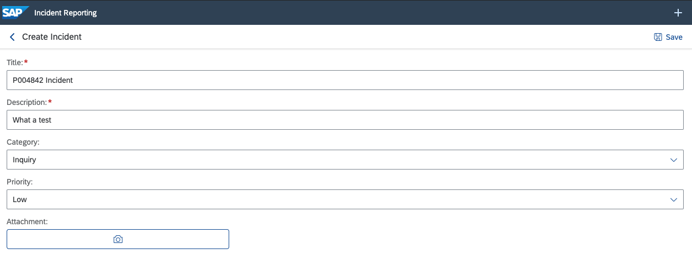

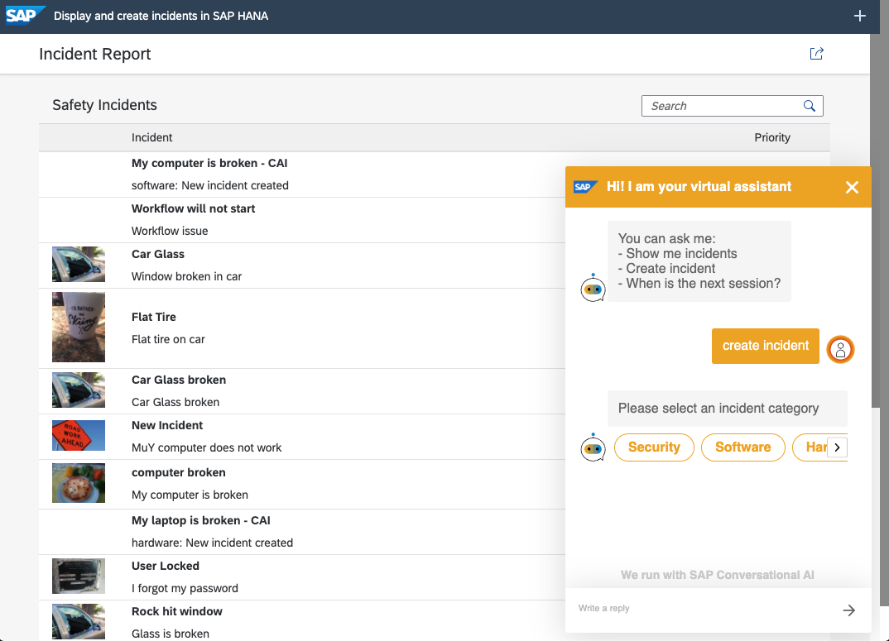

You can now search for the incident you just created with the app or the bot to confirm the incident was created.

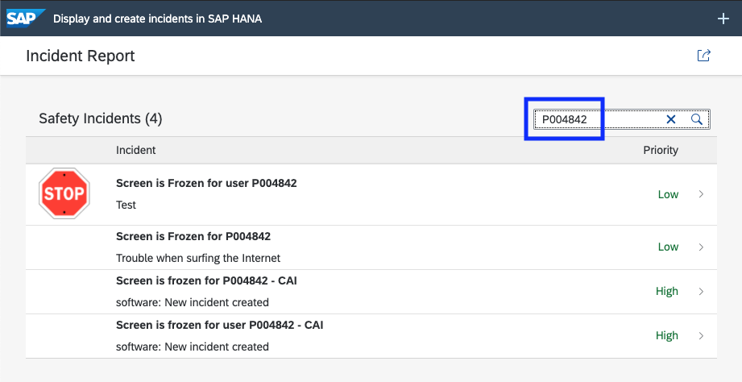

Now go to the service https://davidk-srv.cfapps.us10.hana.ondemand.com/ and click the safetyincidents service.

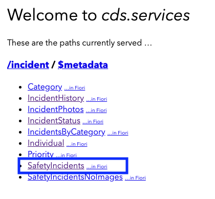

Find the service incident that you created. Copy the ID and notice the status "new". Leave this window open.

** Do not proceed if the status is not new - make sure it is your incident and it is new.**
If there is a problem or question speak with an instructor.*

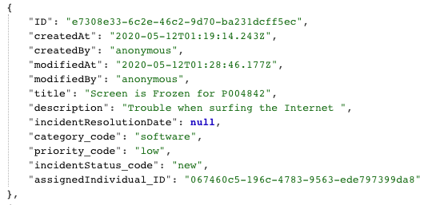

Now we are ready to test the workflow. At the end of week three this will all be automated. 

In step two you had bookmarked the portal instance that was deployed. If you do not remember the endpoint then check the console in the WebIDE or redeploy the workflow setup package. I have added the screenshot from the console where the endpoint was displayed in step two of this exercise.

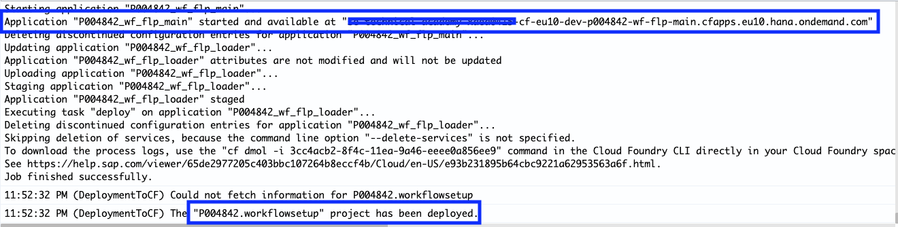

The portal should look like this

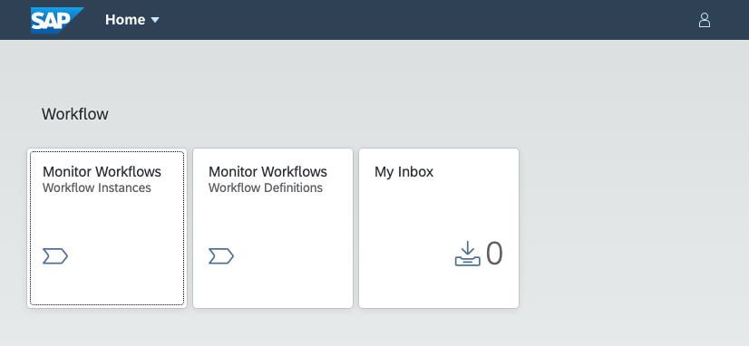

You will have three tiles
* My Inbox: This is where people will go to see their workflows 
* Workflow Definitions: This is where you will test your workflows.   
* Workflow Instances: This is where you can see the workflow details as they are executed

Note: For the purpose of this exercise we have assigned workflow admin roles to all users. Most users would only see the inbox.

Let's click on the Workflow Definitions.  

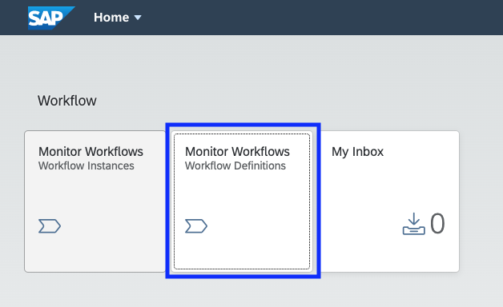

* Find your workflow definition on the left-hand side. Click it 
* Then click "New Instance" at the bottom of the screen.

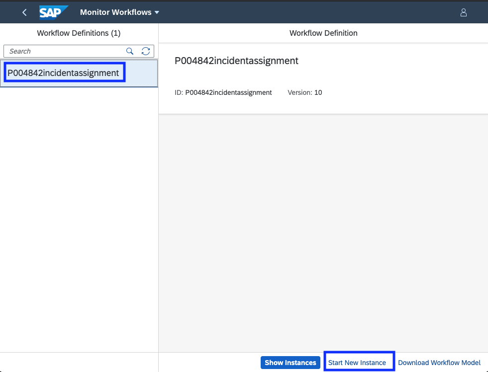

* In the popup you should change the SafteyIncident ID to the ID you created above - This will add the new safety incident to the workflow context
* click "Start New Instance"
* You should get a success message

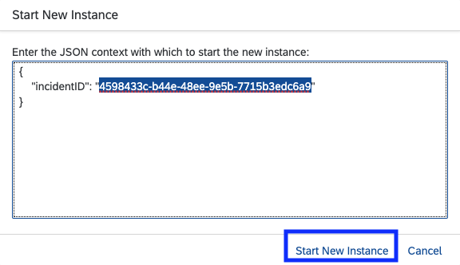

You have just created the new workflow instance. Let's take a look at the workflow.

Click on the home button. 

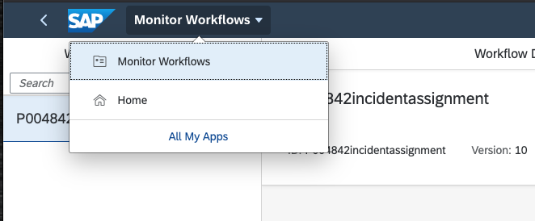

Next, click on the "My Inbox" tile. Notice the number has increased.

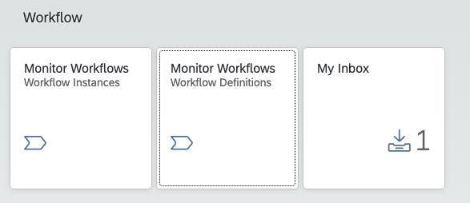

You will now see your workflow.

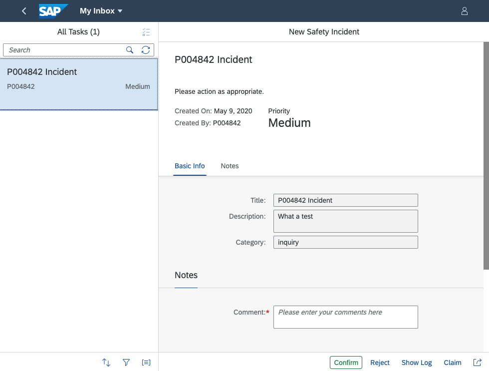

You should now see your workflow. Pay attention to the buttons at the bottom of the screen. You will see the action buttons ("Confirm", "Reject") and a button to view the workflow log. The workflow instance is now running.

**Do not press the "Confirm" or "Reject" buttons.**

```
Question: Why do you only see your workflow and not others?
```

Go back to the service and check the status. The same incident now has a status of "assigned".

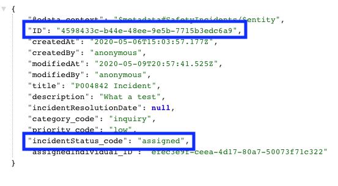

Now let's go back and accept the workflow as if you are the safety officer in your company. In-order to confirm the workflow you will have to add a comment. Try to confirm without adding a comment - you will get an error. 

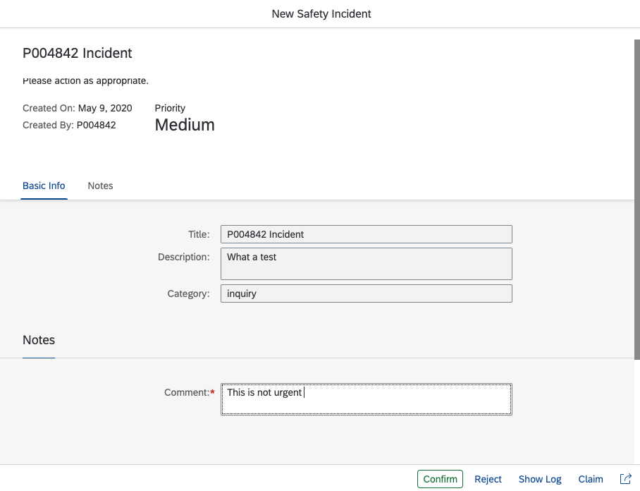

Add a comment and "Confirm" the workflow by pressing the "Confirm" button at the bottom of the Workflow UI.

Let's check the status again via the API. You can see it has been updated to show that it has been "resolved".

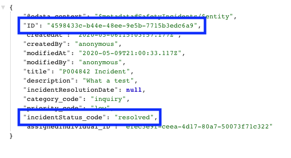

and the last step is to go back to the inbox to see if there are more workflows to action.

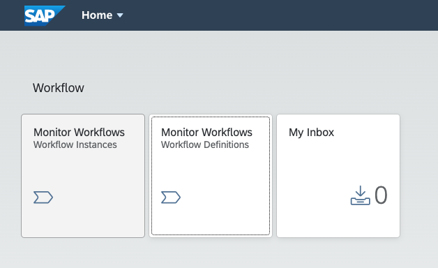

You can see that the inbox has been cleared.

Congratulations - You have successfully deployed, tested and modelled the Safety Incident Workflow and tested the workflow with your service. In the next session - next week you will be adding Enterprise Messaging to connect the CDS service with the workflow. At the end of week three you will be able to create an incident and automatically see the workflow in your inbox.

### (Optional) - Modify the workflow to point to your service

The workflow you have deployed and tested is using a generic test service which all participants are using. In a few weeks you will be creating Safety Incidents. At that time, you will be able to come back to this step to make a minor change to your workflow that was just deployed and point it to your safety incident service.

[Modify the workflow to point to your service]((Optional)%20Modify%20the%20workflow%20to%20point%20to%20your%20service.md)

