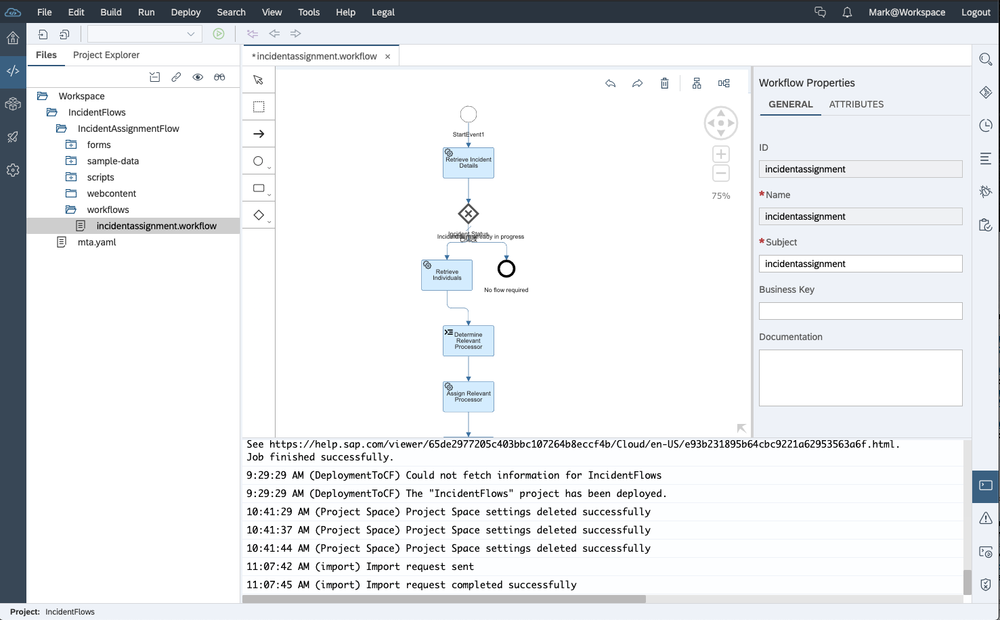
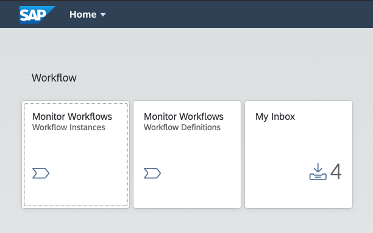
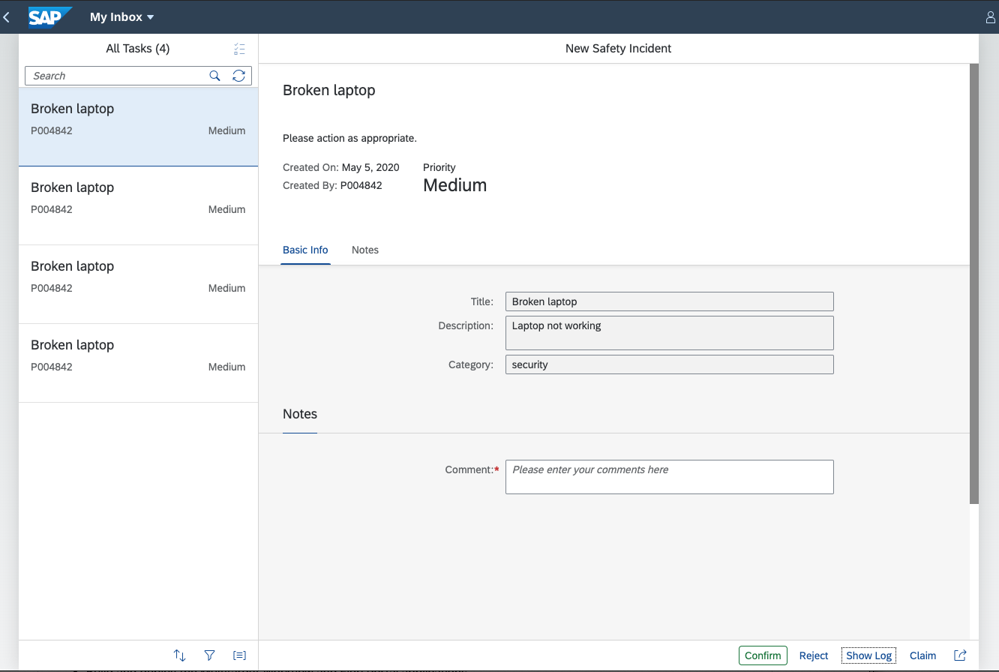

## The Safety Incident Workflow

In part one of this SAP Cloud Platform Virtual Technical Academy, you have already seen how to easily create safety incident services using the Business Application Studio. 

In this section (part two) we will now model workflows that will be triggered when a safety incident is created. 

At the end of this session you will have a live safety incident workflow deployed on SAP Cloud Platform but it will not be using the service you created in week one. You will be using a test service created by SAP.

In a few weeks, we will show you how to create incidents with **your** CAP service. You can then modify this workflow to see Safety Incidents in action - Live.

## The Safety Incident Process 

When a safety incident is logged by an employee, A workflow will be triggered for the safety officer to be notified so that he/she may take the appropriate action. 

As you move through the different sections of this technical academy, you will start to develop an integrated safety incident management application.

In this section you will;
- Understand how to model, test and deploy workflows on SAP Cloud Platform by developing a workflow for Safety Incident Management.

We will be using the SAP WebIDE to model, build and deploy the workflows.

You will see the Fiori Portal, which will be used to manually test, monitor and interact with your workflows.

And you will see the workflows in action as if it was assigned to you as the safety officer for your company.

In part three of this series you will connect the CAP service to SAP Cloud Platform Enterprise Messaging to automatically trigger the workflow when a new incident is logged.  

## SAP Cloud Platform Workflow

In this section, you will be looking at the SAP Cloud platform workflow service. This service lets you build, run, and manage workflows, from simple approvals to end-to-end processes that span across organizations and applications. With an inbox app and custom-built UIs, you involve end users into business processes for decision making and data entry. The service comes with web-based tools for workflow modeling, APIs for consumption in custom apps, monitoring tools, and Fiori-based apps for end-user access. You can use JavaScript to embed custom business logic.

### Features

The workflow service offers an array of workflow capabilities, for example:

#### Model workflows

Design workflows based on Business Process Model and Notation (BPMN) in a graphical editor. Model workflow user interfaces using forms.

#### Monitor and manage workflows

Monitor and manage workflow definitions and workflow instances. Start new workflow instances.

#### Process tasks in an inbox

See all tasks assigned to you. Search and filter for specific tasks, see task details and complete the task.

[Next](Part%201%20-%20Set%20Up%20Workflow%20on%20SAP%20Cloud%20Platform.md)

